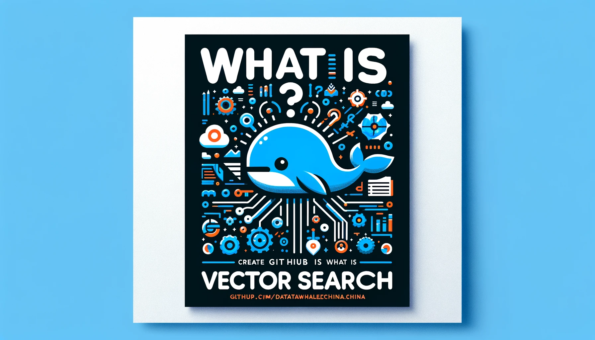

# What is Vector Search

Made by DALL·E

本项目旨在创建一个全面、易于理解的向量检索教程，它将覆盖从基础理论到核心技术的各个方面。教程将通过详细的解释、实例和实践案例，帮助初学者、研究人员以及应用人员深入理解并有效地使用向量检索技术。

*下图是机器之心联合 Datawhale 和向量检索实验室一起出品的向量数据库知识图谱，让大家初步了解一下向量检索领域。*

## 项目受众

- 初学者，希望从基础了解向量检索。
- 相关领域的研究人员，需要了解最新技术和应用。
- 应用人员，需要实际开发应用向量检索技术。

## 目录

- 第一部分：引言
  - [引言](./docs/chapter1/1.1%20introduction.md)
    - 什么是向量检索
    - 向量检索的基本概念
    - 向量检索为什么重要
    - 向量检索的应用场景
    - 关键词检索与向量检索的原理对比
    - 本教程适合的人群
- 第二部分：核心技术
  - [2.1 向量化技术](./docs/chapter2/2.1%20embedding.md)
    - Embedding 的定义
    - 为什么需要 Embedding
    - NLP 中经典的 Embedding 算法
    - 大模型时代下的 Embedding 算法
  - 向量索引
    - [2.2 向量索引](./docs/chapter2/2.2%20index.md)
      - 向量索引
      - 向量索引的评估指标
    - [2.2.1 基于量化的向量索引方法](./docs/chapter2/2.2.1%20pq-based-index.md)
    - [2.2.2 基于哈希的向量索引方法](./docs/chapter2/2.2.2%20hash-based-index.md)
    - [2.2.3 基于树的向量索引方法](./docs/chapter2/2.2.3%20tree-based-index.md)
    - [2.2.4 基于图的向量索引方法](./docs/chapter2/2.2.4%20graph-based-index.md)
    - [2.2.5 基于混合的向量索引方法](./docs/chapter2/2.2.5%20hybrid-index.md)
  - [向量查询](./docs/chapter2/2.3%20vector-query.md)
    - 向量查询方法概述
    - k近邻查询
    - 范围查询
    - 混合查询
    - 多向量查询
    - 其它查询
    - [查询优化](./docs/chapter2/2.3.1%20algorithm.md)
  - [向量检索软硬协同优化](./docs/chapter2/2.4%20hw-sw-codesign.md)
    - [CPU 优化策略](./docs/chapter2/2.4.1%20CPU.md)
    - [FPGA 架构与向量检索](./docs/chapter2/2.4.2%20FPGA.md)
    - [近数据处理架构](./docs/chapter2/2.4.3%20Near-Storage-Processing.md)
- 第三部分：系统实现与应用
  - [向量数据库系统概述](./docs/chapter3/3.1%20system.md)
  - [什么是RAG](./docs/chapter3/3.2%20RAG.md)
  - 基于RAG的知识问答系统实战
    - [基于Langchain的RAG基础实现](./docs/chapter3/3.2.1%20practice.md)
    - [基于Ragas的RAG评价体系](./docs/chapter3/3.2.2%20evaluation.md)
- [第四部分：未来展望和挑战](./docs/chapter4/4.1%20challenge.md)
- [结语](./docs/chapter5/5.1%20summary.md)

## 参与贡献

- 如果你想参与到项目中来欢迎查看项目的 [Issue](https://github.com/datawhalechina/what-is-vs/issues) 查看没有被分配的任务。
- 如果你发现了一些问题，欢迎在 [Issue](https://github.com/datawhalechina/what-is-vs/issues) 中进行反馈🐛。

如果你对 Datawhale 很感兴趣并想要发起一个新的项目，欢迎查看 [Datawhale 贡献指南](https://github.com/datawhalechina/DOPMC#%E4%B8%BA-datawhale-%E5%81%9A%E5%87%BA%E8%B4%A1%E7%8C%AE)。

## 贡献者名单

| 姓名                                      | 职责           | 简介             |
| :---------------------------------------- | :------------- | :--------------- |
| [苏鹏](https://github.com/SuperSupeng)    | 项目负责人     | Datawhale成员    |
| [李剑楠](https://github.com/ljn-aaa)      | 项目主要贡献者 | 华东师范大学硕士 |
| [向隆](https://github.com/BenjaminXiang)  | 项目主要贡献者 | 南方科技大学博士 |
| [王泽宇](https://github.com/CaucherWang)  | 项目主要贡献者 | 复旦大学博士     |
| [王梦召](https://github.com/whenever5225) | 项目主要贡献者 | 浙江大学博士     |
| [田冰](https://github.com/tianbing111)    | 项目主要贡献者 | 华中科技大学博士 |
| [韩颐堃](https://github.com/YikunHan42)   | 项目主要贡献者 | Datawhale成员  |

分工请见：[立项申请（what-is-vs #184）](https://github.com/datawhalechina/DOPMC/issues/184)

## 关注我们

扫描下方二维码关注公众号：Datawhale

## LICENSE

 本作品采用<a rel="license" href="http://creativecommons.org/licenses/by-nc-sa/4.0/">知识共享署名-非商业性使用-相同方式共享 4.0 国际许可协议</a>进行许可。