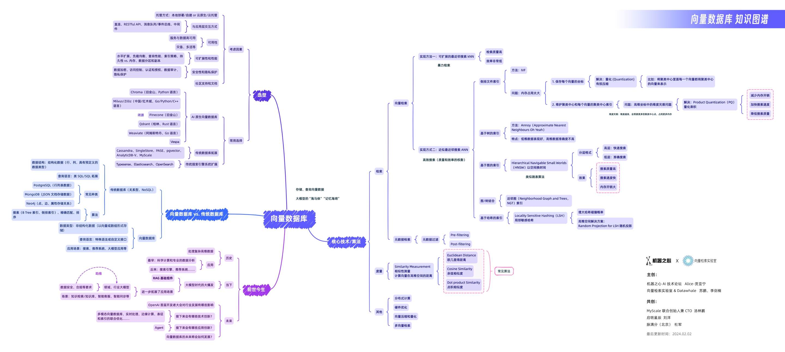

# 向量检索与 RAG 实践：技术、实现与应用

本项目旨在创建一个全面、易于理解的向量检索 + RAG 教程，它将覆盖从基础理论、核心技术到实战应用的各个方面。教程将通过详细的解释、实例和实践案例，帮助初学者、研究人员以及应用人员深入理解并有效地使用向量检索技术。

*下图是机器之心联合 Datawhale 和向量检索实验室一起出品的向量数据库知识图谱，让大家初步了解一下向量检索领域。*

## 项目受众

- 初学者，希望从基础了解向量检索以及 RAG。
- 相关领域的研究人员，需要了解最新技术和应用。
- 应用人员，需要实际开发 RAG 应用同时应用向量检索技术。

## 目录

---

上篇：向量检索基础

---

- 第一章：引言
  - 1.1 什么是向量检索
  - 1.2 向量检索的基本概念
  - 1.3 向量检索为什么重要
  - 1.4 向量检索的应用场景
  - 1.5 关键词检索与向量检索的原理对比
- 第二章：向量技术
  - 2.1 Embedding 的定义
  - 2.2 为什么需要 Embedding
  - 2.3 NLP 中经典的 Embedding 算法
  - 2.4 大模型时代下的 Embedding 算法
- 第三章：向量索引技术
  - [3.1 向量索引的基本概念](./docs/chapter2/2.2%20index.md)
  - 3.2 向量索引的评估指标
  - 3.3 常见的向量索引方法
    - [2.2.1 基于量化的向量索引方法](./docs/chapter2/2.2.1%20pq-based-index.md)
    - [2.2.2 基于哈希的向量索引方法](./docs/chapter2/2.2.2%20hash-based-index.md)
    - [2.2.3 基于树的向量索引方法](./docs/chapter2/2.2.3%20tree-based-index.md)
    - [2.2.4 基于图的向量索引方法](./docs/chapter2/2.2.4%20graph-based-index.md)
    - [2.2.5 基于混合的向量索引方法](./docs/chapter2/2.2.5%20hybrid-index.md)
- [第四章：向量查询与优化](./docs/chapter2/2.3%20vector-query.md)
  - 4.1 向量查询方法概述
  - 4.2 k近邻查询
  - 4.3 范围查询
  - 4.4 混合查询
  - 4.5 多向量查询
  - [4.6 查询优化](./docs/chapter2/2.3.1%20algorithm.md)
- [第五章：向量检索软硬件协同优化](./docs/chapter2/2.4%20hw-sw-codesign.md)
  - [5.1 CPU 优化策略](./docs/chapter2/2.4.1%20CPU.md)
  - [5.2 FPGA 架构与向量检索](./docs/chapter2/2.4.2%20FPGA.md)
  - [5.3 近数据处理架构](./docs/chapter2/2.4.3%20Near-Storage-Processing.md)
- 第六章：系统实现与应用
  - [6.1 向量数据库系统概述](./docs/chapter3/3.1%20system.md)
  - 6.2 如何实现使用文本搜索图片
  - 6.3 向量检索在实际应用中的案例研究

---

下篇：检索增强生成（RAG）实战

---

- 第七章：检索增强生成（RAG）基础
  - [7.1 什么是RAG](./docs/chapter3/3.2%20RAG.md)
  - 7.2 RAG 的关键概念与流程
  - 7.3 RAG 的优势与挑战
- 第八章：RAG 的实现技术
  - 8.1 RAG 系统的技术栈
  - [8.2 基于 Langchain 的 RAG 实现](./docs/chapter3/3.2.1%20practice.md)
  - [8.3 基于 Ragas 的 RAG 评价体系构建](./docs/chapter3/3.2.2%20evaluation.md)
- 第九章：RAG 实战与优化
  - 9.1 RAG 系统构建指南
  - 9.2 数据集构建与管理
  - 9.3 从向量检索到 RAG 的综合优化技巧
  - 9.4 RAG 在实际应用中的案例研究
- [第十章节：未来展望和挑战](./docs/chapter4/4.1%20challenge.md)
- [第十一章：结语](./docs/chapter5/5.1%20summary.md)

## 参与贡献

- 如果你想参与到项目中来欢迎查看项目的 [Issue](https://github.com/datawhalechina/what-is-vs/issues) 查看没有被分配的任务。
- 如果你发现了一些问题，欢迎在 [Issue](https://github.com/datawhalechina/what-is-vs/issues) 中进行反馈🐛。

如果你对 Datawhale 很感兴趣并想要发起一个新的项目，欢迎查看 [Datawhale 贡献指南](https://github.com/datawhalechina/DOPMC#%E4%B8%BA-datawhale-%E5%81%9A%E5%87%BA%E8%B4%A1%E7%8C%AE)。

## 贡献者名单

| 姓名                                      | 职责           | 简介             |
| :---------------------------------------- | :------------- | :--------------- |
| [苏鹏](https://github.com/SuperSupeng)    | 项目负责人     | Datawhale成员    |
| [李剑楠](https://github.com/ljn-aaa)      | 项目主要贡献者 | 华东师范大学硕士 |
| [向隆](https://github.com/BenjaminXiang)  | 项目主要贡献者 | 南方科技大学博士 |
| [王泽宇](https://github.com/CaucherWang)  | 项目主要贡献者 | 复旦大学博士     |
| [王梦召](https://github.com/whenever5225) | 项目主要贡献者 | 浙江大学博士     |
| [田冰](https://github.com/tianbing111)    | 项目主要贡献者 | 华中科技大学博士 |
| [韩颐堃](https://github.com/YikunHan42)   | 项目主要贡献者 | Datawhale成员  |

## 关注我们

扫描下方二维码关注公众号：Datawhale

## LICENSE

 本作品采用<a rel="license" href="http://creativecommons.org/licenses/by-nc-sa/4.0/">知识共享署名-非商业性使用-相同方式共享 4.0 国际许可协议</a>进行许可。