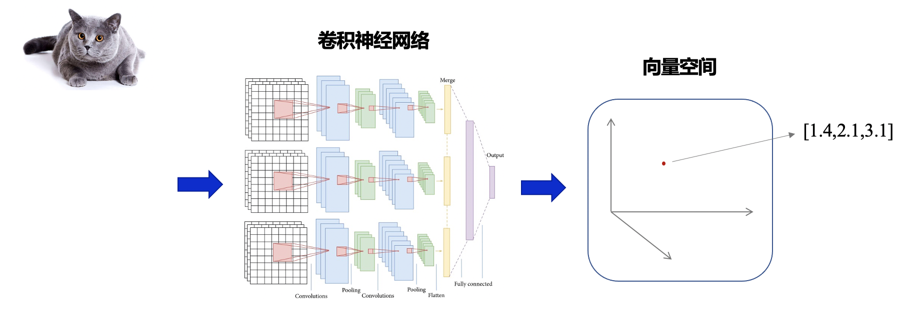
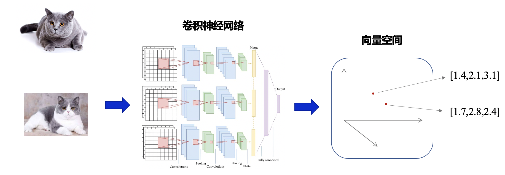
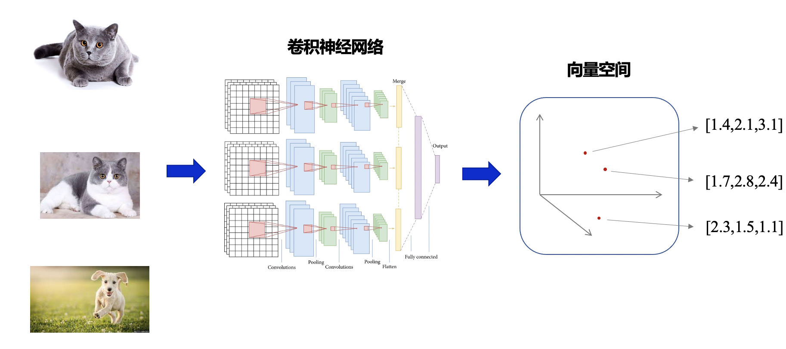
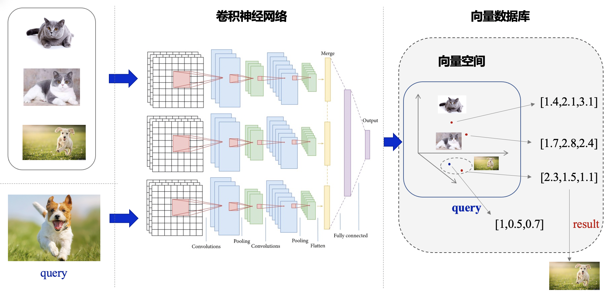
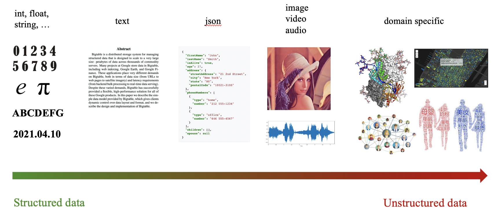
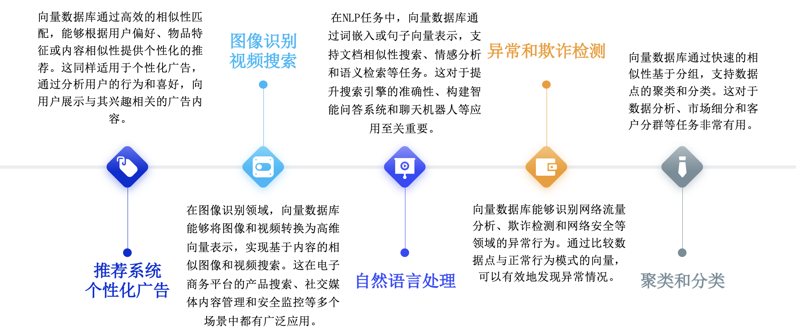
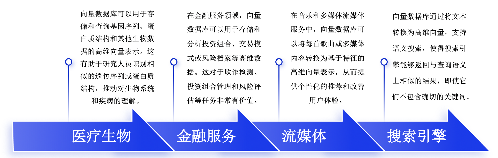
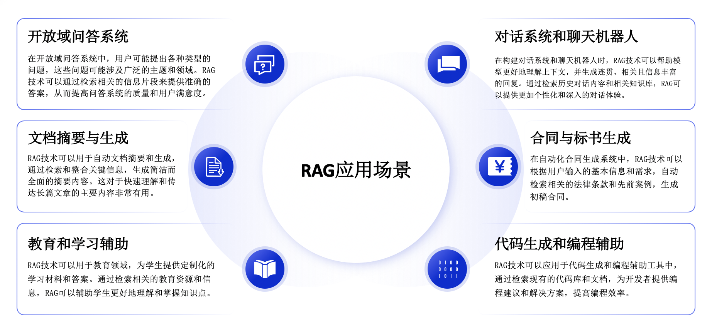

# 什么是向量检索

向量检索最早应用于图像处理和计算机视觉等领域，后来在自然语言处理、生物信息学、推荐系统等领域得到了广泛应用。向量检索的核心优势在于其能够处理和分析高维度非结构化数据，这在传统关系型数据库中是难以实现的。然而，由于前期 AI 等技术的发展限制，大量非结构化数据无法被有效处理，这使得向量检索在很长一段时间内处于小众发展的状态。

但是大语言模型（Large Language Model, LLM）的出现让本来小众的向量检索技术从幕后走到了台前，得到了大家极大的关注，同时向量检索的应用场景得到了极大扩展。主要原因是大模型由于其技术架构和数据限制，存在以下局限性：

- 模型幻觉问题：大语言模型在生成内容时，有时会产生不准确或不真实的信息，这被称为“模型幻觉”。
- 实时数据访问问题：大语言模型通常基于预训练数据进行推理，难以实时访问和更新信息。
- 企业数据访问问题：大语言模型在处理企业级数据时，面临数据安全和隐私保护的挑战。
- 模型推理资源消耗大：大语言模型在推理过程中需要消耗大量的计算资源，导致其落地成本高昂。

这些局限性问题可以通过向量检索来部分解决，从而支持实时推理、智能问答、辅助决策等任务。同时大模型的广泛应用对向量检索页提出了更高的要求，不仅需要更高的准确率和查询速度，还需要作为一个整体系统（向量数据库、多模数据库等），提供更好的扩展性、吞吐能力、易用性等特征。

本教程的目的就是希望帮助大家全方面的了解向量检索领域的基础概念，主要研究方向以及未来潜在的发展前景。

## 向量检索的基本概念

向量检索技术其实对于大家来说并不陌生，相信大家应该都用过淘宝的”拍立淘“，Google 的以图搜图，这些背后都是通过向量检索技术来实现的。下面我们来看一个以图搜图的例子。

当我们有一张小猫的图片时，我们可以将其输入一个神经网络（embedding model），通过这个网络后，小猫的图片会转成一堆数字，也就是我们常说的向量（embedding）

当输入第二张小猫图片时，经过相同的神经网络，会产生相同维度的一堆数字

这时我们输入一张小狗的图片时，经过相同的神经网络，因为神经网络本身会学习图像的特征，所以它能够识别出来此时输入的小狗的图片是和小猫的图片的不同的，此时小狗的图像经过模型后也会产生相同维度的一堆数字，但是他和小猫生成的数字之间距离会比较远。

当我们输入另外一张小狗的图片作为查询图片时，这张图片也会经过相同的神经网络，生成一堆数字。此时需要找到与这张图像最相似的图怎么办，我们可以发现生成的向量是数字，数字的特点就是可以进行算数运算，此时我们可以两两向量进行相减，哪两个向量之间相减最接近 0 我们就认为他们之间最相似，从而也就实现了以图搜图的功能。

也可以想象一下，在互联网的广阔海洋中，每一句话都是一颗星星，而我们需要找的不仅仅是特定的词汇，而是那些能够发出相似光芒、表达相似意义的星群。传统的关键词搜索就像是通过望远镜寻找特定颜色的星星，它可能会因为关键词的限制而错过那些含义相近但用词不同的星星。向量检索不直接搜索特定的词汇，而是将这些话语转化为向量，即在多维空间中的点。

这样，当你尝试寻找关于“勇气”的内容时，向量检索不仅能够识别出明确使用了“勇气”一词的句子，还能够发现那些描述“英雄行为”、“无畏面对困难”等含义相近但表述不同的内容。这就像在夜空中寻找不仅亮度相似，而且在空间中彼此靠近的星群，即使它们的颜色不完全相同。

通过理解和比较这些向量的距离和方向，向量检索能够揭示出深层的语义联系，使得即便是用不同词汇表达的思想和概念也能被轻松捕捉。这种技术让搜索变得更加智能化，不仅提升了效率，还增加了探索未知的乐趣，使得我们能够在这广阔的信息宇宙中，发现那些真正意义上与我们查询意图相匹配的星辰。

## 向量检索为什么重要

IDC 在《Data Age 2025》的报告中预测，从2018年到2025年，全球数据将从33ZB急速增长到175ZB，比2016年产生的数据量增加了十倍，预测到2025年非结构化数据（图片，视频，文本等）占企业数据的80%以上，并且以每年55%的速度增长，而传统的关键词等搜索方法在处理海量非结构化数据时面临着效果欠佳或无法处理等问题，而向量检索的语义搜索能力，为搜索系统提供了重要的能力补充，使得非结构化数据能够被有效的利用，从而产生了各种丰富的应用场景，例如猜你喜欢，听歌识曲等。

而且随着大模型技术的演进，向量检索技术将伴随 AI 成为更加核心的角色，例如在大模型推理、检索增强生成（Retrieval-Augmented Generation, RAG）技术知识库构建以及跨模态行业应用等场景，提升了模型的推理效率、输出准确性和行业应用的深度，都将展现出向量检索的重要价值和广泛应用前景。

## 向量检索的应用场景

### 传统向量检索应用场景

### 结合大模型的应用场景

# 本教程适合的人群

本教程旨在通过浅显易懂的语言和生动的案例，由浅入深全面介绍向量检索的原理、重要研究方向与实践案例。无论是向量检索的初学者，还是希望深化理解的研究人员和开发者，都能从本教程中获得有价值的知识和技能。我们将通过丰富的实例、代码演示和拓展阅读资料，确保读者能够深入理解向量检索的概念、原理及其在实际应用中的运用。

- 教程将由浅入深，循序渐进地介绍向量检索的原理、重要研究方向与实践案例。
- 教程适合无基础的初学者，也能满足研究人员和开发者的进阶需求。我们将提供基础知识点的详细解释，并引导读者探索更深层次的研究内容和技术挑战。
- 通过本教程的学习，读者将建立起向量检索的完整知识体系，并具备开发实际应用的能力。读者可以学习如何构建自己的向量检索系统，以及如何优化和调试现有的系统以满足特定的需求。
