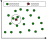
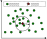
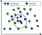
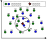

# 3 向量查询

## 3.1 向量查询概述

**向量查询**旨在从大规模向量数据集中获取与给定查询向量最相似的一些向量。其中，向量之间的相似性一般通过距离函数定义，比如欧式距离、内积等。朴素的方式是直接计算查询向量与数据集中所有向量的距离，而后通过排序获取结果向量。这种方式虽能准确获取最相似的向量，但其计算复杂度较高而难以实际应用。因此，我们通常在向量数据集中构建向量索引以支持高效的向量查询。此外，为了进一步提升向量查询的效率，我们一般允许少量精度的损失从而换取大幅度的效率提升。无论是在学术界还是在工业界，我们所说的向量查询通常是近似向量查询，即查询结果存在误差。为了度量查询结果的准确度，我们一般使用召回率（Recall）或精度（Precision）。对于查询的效率，我们通常用吞吐量（Throughput）或延迟（Latency）来衡量。根据对查询结果或查询输入信息的不同要求，现有的向量查询可分为$k$近邻查询、范围查询、混合查询、多向量查询等。此外，为了提升查询的效率和准确度，我们可以通过新型硬件加速、学习方法、近似计算等对查询过程进行优化。

## 3.2 $k$近邻查询

### 3.2.1 什么是$k$近邻查询？

$k$近邻查询（$k$-Nearest Neighbor Query）是最广泛使用的一种向量查询方法，其目标是在数据集中搜索与查询向量最相似的$k$个向量。如图3.1所示，在一个二维平面上，绿色的圆点代表我们的向量数据集，红色的五角星作为查询点（即查询向量），黑色圆圈内的两个绿色点是查询点的top-2最近邻居。通过$k$近邻查询，我们要找到与查询点距离最近的$k$个点。在计算距离时，我们通常使用欧式距离，但也可以使用其他距离度量。

图 3.1 Top-k查询示意图

### 3.2.2 $k$值选择

在$k$近邻查询中，$k$值的确定通常由特定的应用或问题背景来驱动。显然，$k$值的选择会影响查询的结果和性能。在有些应用中，$k$值可以通过交叉验证得到，这旨在挑选出一个使得预测误差最小的$k$值。另外，也可以通过不断改变$k$值，观察结果的变化来确定一个合适的$k$值。然而，通过实验可以发现，不同的数据集，最优的$k$值可能会有很大不同，而且并没有一个固定的数值。在确定合适的$k$值时，需要综合考虑查询量、存储开销、查询时间、准确性等多个因素。

### 3.2.3 评估方法

在实际应用中，$k$近邻查询的准确度和效率是需要衡量的两个重要指标。由于在高维空间中获取完全精确的$k$近邻具有较高的复杂度（$O(n)$，$n$为数据规模），难以实际应用。因此，当前学界和业界主要关注近似$k$近邻查询，即通过少量精度的损失换取大幅度的效率提升。当前$k$近邻查询的相关算法主要是对精度和效率进行权衡，比如HNSW, IVFPQ等。当前针对准确度和效率，有一些常见的评估方法。准确度的评估通常使用召回率，在信息检索领域，召回率的定义如下：
$$
Recall=\frac{TP}{TP+FN}
$$
其中，$TP$（True Positive）表示查询到的相关目标数量，$FN$（False Negative）表示未查询到的相关目标数量。 在$k$近邻查询中，我们可以将$k$定义为需要获取到的与查询向量最近的向量数量，将$r$定义为实际召回的$k$个向量中属于真实前$k$个向量的数量（$r\leq k$），那么召回率的计算方法可表示为： 
$$
Recall=\frac{r}{k}
$$
效率的评估通常通过吞吐量和延迟来衡量。吞吐量是指在单位时间内，可以处理的查询个数。而延迟是指从提交查询到获取结果所需的时间。这两者通常是一对矛盾的指标，提高吞吐量往往会付出延迟上升的代价，反之亦然。因此，在实际应用中，需要根据查询需求和硬件资源以及查询结果的可接受程度来进行权衡。

### 3.2.4 应用场景

在真实世界的应用中，$k$近邻查询广泛应用于各种领域。例如，在保险行业，$k$近邻查询方法被用于评估潜在客户的风险等级。具体来讲，当一个新的潜在客户提交了他们的个人信息和保险需求，保险公司会利用$k$近邻查询方法去在他们的历史客户数据中搜索与新客户最相似的$k$个已有客户。 在这个例子中，每个客户的信息会被视为一个多维向量，其中每个维度都表示一个与风险相关的特征，比如年龄、体重、是否吸烟、职业，等等。新客户的信息也同样被视为一个向量。然后，根据这些特征，在历史数据集中搜索与新客户最相似（最接近）的$k$个历史客户。 在找到这$k$个“邻居”后，公司会查看他们的保险理赔记录。如果大部分或所有的这些“邻居”都有较高的理赔记录，那么，这个新的潜在客户就可能被评估为高风险。反之，如果他们的“邻居”的理赔率较低，那么新客户就会被认为是低风险。 这个过程是自动化的，甚至可以实时完成，使得保险公司能够迅速而准确地为每一个新的潜在客户提供定制化的保险报价。这种方式能够保证风险的有效评估，让保险公司能够合理地定价，并降低潜在的金融风险。同时，它也为客户提供了更真实，更公正的保险费率。

## 3.3 范围查询

### 3.3.1 什么是范围查询？

范围查询（Range Query）旨在获取与给定查询距离不超过$r$的所有向量。如图3.2所示，在一个二维平面上，绿色的圆点代表我们的向量数据集，红色的五角星作为查询点（即查询向量）。通过范围查询，我们要找到与查询点距离不超过$r$的所有绿色点。在图3.2中，黑色圆圈内的所有绿色点均是范围查询的结果。在计算距离时，我们通常使用欧式距离或内积，注意内积值越大，距离越小。与$k$近邻查询不同，范围查询获取的结果数量并没有预先给定。在某些情况下，范围查询的结果可能为空，即不存在与查询距离小于$r$的向量，在另一些情况下，范围查询的结果可能高达几万个。因此，范围查询的结果数量是动态变化的，就查询性能而言，它比$k$近邻查询更具挑战性。

图 3.2 范围查询示意图

### 3.3.2 范围$r$的选择

在范围查询中，搜索半径$r$是一个判断向量是否应返回的阈值参数。范围的选择通常取决于特定的应用场景和问题背景，选择合适的范围阈值$r$对于向量查询来说充满挑战。值得注意的是，大多数应用并不需要用户显式指定阈值$r$，而是采用各种策略，如从数据中学习一个阈值$r$，或者从中间结果中导出一个阈值$r$。对于那些真实结果数量（$k$）未知但可以推导出的场景，范围查询是非常有用的。此外，绝对距离值可能毫无意义，这促使许多机器学习方法通过诸如标准化等机制来重新缩放距离。然而，在重新缩放的距离上，阈值$r$也会变化，有些研究在标准化后的向量上使用阈值$r$。例如，在商品检索中，我们可能需要寻找内积超过0.9的向量。

### 3.3.3 评估方法

与$k$近邻查询不同，范围查询的准确度一般通过平均精度（Average Precision，AP）来衡量。平均精度被定义为在遍历有序结果列表时，在召回率上精度的平均值（average precision over recall）。精度和召回率两个指标结合使用，可以很好地反映范围查询的性能表现。 对于可以保证所有返回的结果都是正确的查询方法（即所有返回的结果都在与查询向量给定的距离$r$之内），他们的结果的精度将始终为1。在这种情况下，AP值等同于召回率的值，可以用已知真实结果集$R_{range}$和查询返回结果集$R^\prime_{range}$计算得出：
$$
AP = \frac{|R^\prime_{range}|}{|R_{range}|}
$$

$AP$不仅能够衡量查询结果的精确性，还能够反映结果的完整性和查全率。另外，范围查询的效率指标与$k$近邻查询一致。

### 3.3.4 应用场景

在视频去重应用中，每个视频都由一个向量表示。由于无法知道与给定视频重复的视频的确切数量，所以我们需要搜索所有可能与该视频相似的视频。在向量空间中，所有接近查询的向量都应被找到。搜索半径$r$是一个经验设置的参数，用于定义两个视频是否相似。对于通用的嵌入向量，范围查询也有着广泛的应用。在推荐系统或者视觉图像浏览系统中，向量查询可能从$k$近邻查询开始，获得$k$个种子顶点和他们的阈值$r$（查询点和种子顶点之间的距离）。然后，使用种子顶点（作为新的查询）和阈值$r$进行范围查询，从而找到相似的簇，并提供个性化的推荐。例如，用户可以挑选一个期望的种子顶点来获取所有相关的结果。此外，在面部聚类应用中，范围查询和经验阈值$r$用于获取和查询面部相似的结果聚类。随着对通用嵌入向量的范围查询需求的增长，一些向量检索库VBase，Pinecone，Milvus，Faiss已经同时支持范围查询和$k$近邻查询。

### 3.3.5 拓展

范围查询是在高维数据中查找距离查询点在指定阈值内的数据点，而相似性连接（similarity join）则进一步将这些接近的数据点对进行匹配，以确定彼此之间的相似性关系。相似性连接旨在找到在给定距离阈值内彼此接近的点对。我们考虑两个数据集$R$和$S$，一个距离阈值$\epsilon$以及一个距离度量$d(\cdot, \cdot)$，并将数据集$R$中的每个点与数据集$S$中与之足够接近（或相似）的点配对。这可以形式化地表示为：
$$
R \bowtie_{\epsilon} S = \{(r, s) | \forall r \in R, \forall s \in S \text{ 且 } d(r, s) \leq \epsilon\}
$$
换句话说，相似性连接操作的目标是找到所有在给定距离阈值$\epsilon$内彼此接近的数据点对。这种操作广泛应用于诸如近似重复检测、数据集成、数据探索和隐私保护等多个领域。

相似性连接和范围查询的区别：

1. 相似性连接：
   - 目的是找到在给定距离阈值内彼此接近的点对。
   - 针对两个数据集$R$和$S$，通过比较它们之间数据点对的距离来确定是否彼此相似。
   - 结果是找到所有在距离阈值内相似的数据点对。
   - 通常用于识别数据集中相似的数据对象，例如在近似重复检测或数据集成中。

2. 范围查询：
   - 目的是找到所有与查询点的距离小于给定阈值的数据点。
   - 针对单个数据集，通过与查询点的距离来确定哪些数据点在指定的距离范围内。
   - 结果是找到所有在指定距离范围内的数据点。
   - 通常用于查找数据集中与查询点接近的数据点，而不是确定数据点之间的相似性。

因此，相似性连接侧重于确定数据点之间的相似性，而范围查询侧重于找到与查询点在指定距离范围内的数据点。这两种操作在不同的场景和应用中具有不同的用途和目的。

## 3.4 混合查询

### 3.4.1 什么是混合查询?

在很多实际应用中，我们处理的数据通常不仅包含向量值，更拥有丰富的属性信息，如商品的价格、颜色等等。这些属性可以以多种方式为潜在的查询提供约束条件，从而提升查询结果的准确性和丰富性。 混合查询（Hybrid Queries）的概念就是在此背景下产生，它结合了向量查询与属性约束，将属性作为搜索约束的一部分，使得查询更具灵活性，可以满足更复杂和多样化的查询需求。根据属性类别的差异，混合查询可分为标签属性约束的向量查询和范围属性约束的向量查询两大类。

举例来说，我们想从一个庞大的商品数据库中搜索出与我们指定商品相似且符合一系列属性条件的商品。这时，混合查询就可以发挥作用，它不仅会根据向量（如商品的特征）进行相似度比对，还会根据我们设定的属性条件（例如价格区间、颜色）来进行筛选。这样，查询的结果既满足了我们对商品特征的需求，也符合商品的属性条件。 

### 3.4.2 标签属性约束的向量查询

标签属性约束的向量查询要求查询结果的标签属性需要与查询输入的标签属性完全匹配。基于这个前提条件，它将在满足特定标签属性的向量范围内进行$k$近邻查询或范围查询（下文均以$k$近邻查询为例），以寻找与查询向量最相似的$k$个向量。 图3.6分别以绿色和蓝色圆点代表标签属性不同的向量数据集，绿色五角星是查询向量，我们的目标是搜索标签属性与之匹配的向量。 此类查询首先根据标签属性进行筛选，即只有当向量的标签属性与查询输入的标签属性完全一致时，我们才会考虑这个向量。在筛选出的向量中，我们继续进行$k$近邻查询，选择出与查询向量距离最近（相似度最高）的$k$个向量。 比如在图3.6中，我们首先对所有绿色的点进行筛选，然后在被筛选出来的绿色点中，找到与查询点最相近的两个绿色点，这就是标签属性约束的向量查询结果。

  
 
图 3.3 标签属性约束的向量查询示意图

### 3.4.3 范围属性约束的向量查询

范围属性约束的向量查询要求查询结果的向量属性需要在特定的范围内。根据这个范围条件，这种查询方式将在属性满足特定范围约束的向量集合内进行相似性搜索，以找到与查询向量最相似的$k$个向量。假设我们的向量数据集由图3.7中的圆点表示，其中，每个圆点关联的数值代表价格值，红色五角星是查询向量，我们的目标是获取价格范围在30～60之间的最近的向量。在范围属性约束的向量查询中，我们首先根据范围属性约束进行筛选，只考虑在特定范围内的向量。在被筛选出来的向量中，我们再进行相似性查询，找到与查询向量最相似的$k$个向量。比如在图3.7中，我们首先选择所有符合范围约束的数据点（绿色点），然后在被筛选出来的绿色点中，我们寻找与查询点最相似的两个绿色点，这就是范围属性约束下的向量查询结果。

  
 
图 3.4 范围属性约束的向量查询示意图

**标签属性约束的向量查询和范围属性约束的向量查询的区别：**

标签属性约束的向量查询和范围属性约束的向量查询都是混合查询的方法，但它们在处理属性约束时有所不同。标签属性约束的向量查询是基于标签相等性进行筛选的。它要求查询结果中的向量需要拥有与查询标签属性完全相同的属性。换句话说，标签属性约束的向量查询按照一个固定的、非连续的标签进行筛选。例如，“找出所有型号为A的商品”就是一个标签属性约束的查询。而范围属性约束的向量查询则更加灵活，它允许在一定范围内的属性值进行筛选。这类约束典型的例子包括数值属性，比如价格、时间等等，这些属性往往是连续的。例如，“找出所有价格在100到200元之间的商品”就是一个范围属性约束的查询。总的来说，标签属性约束的向量查询关注相等性，常常用于处理离散的、非连续的属性；而范围属性约束的向量查询则关注连续性，常用于处理连续的属性。

### 3.4.4 评估方法

对于混合查询中的标签属性约束的向量查询和范围属性约束的向量查询，评估其查询效率的指标与$k$近邻查询或范围查询一致，不同之处在于评估查询结果的准确度。在标签属性约束的向量查询中，我们需要确保查询结果中的向量与输入的标签属性完全匹配。因此，召回率可以通过检查所有符合标签属性并且与查询向量近似的向量是否都在查询结果中被找出来来进行评估。在范围属性约束的向量查询中，我们需要确认查询结果的属性都在指定的范围内。评估召回率时，我们可以通过查看所有满足属性范围约束且与查询向量相似的向量是否都被检索出来来进行计算。

### 3.4.5 应用场景

混合查询在许多实际应用场景都有所体现，下面通过一个真实的例子对这一点进行说明。 在一个电商平台上，用户希望查找与当前浏览的商品相似且满足特定条件的其他商品。查询的条件可以是标签属性，例如商品的品牌，或者是范围属性，例如价格区间。

**标签属性约束的向量查询。** 假设用户正在浏览一款Nike的跑鞋，并希望查找更多同品牌的相关商品。此时，我们就可以通过标签属性约束的向量查询，将查询的标签属性设置为“Nike”。该查询首先会筛选出所有品牌为Nike的商品，再在这些商品中寻找与当前商品最相似的几个商品。例如，用户想要找到同品牌的最相似的5个商品，那么我们就可以将$k$设定为5，执行向量查询。通过这种查询方式，用户可以方便地找到他们感兴趣的、同品牌的商品。

**范围属性约束的向量查询**。 假设用户希望找到价格在200到500元之间，与当前正在浏览的商品最相似的商品。这时，我们就可以通过范围属性约束的向量查询，将价格的范围设定为200到500元。系统首先筛选出在这个价格区间的商品，然后在筛选结果中进一步检索与正在浏览的商品最相似的几个商品。这样，用户就能在自己能承受的价格范围内，找到最符合他们需求的商品。

这样的应用场景在各大电商平台中都十分常见，标签属性约束的向量查询和范围属性约束的向量查询的混合使用使得用户的查询体验更加个性化。用户不仅可以根据具体的标签属性找到同类商品，如同品牌，同类别等，同时还可以根据特定的范围属性，如价格区间，搜索满足特定条件的商品。此外，混合查询方法还广泛应用于其它各个领域。例如，在社交媒体中，可以通过这种方法找到与关注的人物有相同兴趣或者同在一定年龄范围内的用户；在新闻推荐中，可以找到与一篇文章主题相近且发布时间在一定日期范围内的相关新闻等等。 总体来说，标签属性约束的向量查询和范围属性约束的向量查询的应用极其广泛，几乎在任何需要进行个性化推荐和高效搜索的地方都有所体现。

## 3.5 多向量查询

### 3.5.1 什么是多向量查询？

在很多应用中，为了提高准确度，每个实体都会通过多个向量进行描述。例如，在智能视频监控应用中，多个向量被用来描述每个被摄像头捕获的人的正面、侧面和姿态。在食谱搜索应用中，多个向量被用于表示每个食谱的文本描述和相关图片。还有很多应用程序会使用多个机器学习模型来更好地描述同一对象。在这些应用场景中，多向量查询（Multi-Vector Queries）变得越来越重要。

多向量查询允许在一个集合中同时对多个向量字段进行查询。每个向量字段可以表征实体的不同方面、不同的嵌入模型或者不同的数据模态，这样的设计极大地丰富了信息的表达形式和搜索的精确性。通过多向量查询，我们可以执行不同向量字段的搜索请求，并通过特定的重新评级策略，如相互排名融合（Reciprocal Rank Fusion，RRF）和加权评分方式（Weighted Scoring）来整合结果。

### 3.5.2 评估方法

多向量查询的评估指标与一般向量查询没有明显区别。需要注意的是，在计算召回率时，多向量查询是将综合评分最高的结果作为最终查询结果。

### 3.5.3 应用场景

多向量查询同样具有广泛的应用场景。 假设我们要开发一个图像搜索引擎，用户可以通过提交一段文本描述和一张参考图片来找到他们想要的图片。在这种情况下，我们会有两个向量：一个是由文本描述生成的向量，另一个是由参考图片生成的向量。我们需要经过以下步骤来进行多向量查询： 

步骤一：将文本和图片各自转化为向量。我们可以使用深度学习模型，如BERT（用于文本）和ResNet（用于图片）来获取向量。

步骤二：使用这两个向量进行查询。在这个搜索引擎中，每一个图片都会有一个相应的文本描述，因此，它们也可以同时被转化为一个文本向量和一个图像向量。

步骤三：评估两个查询向量与数据库中每一对向量的匹配程度。这样，我们就可以找到与查询最相似的图片和描述。

步骤四：综合文本向量和图片向量的查询结果，返回最相关的结果。

在这个案例中，仅使用图像是不够的，因为它可能无法提供某些具体的描述，而文本描述可以提供这些信息。相反，如果只有文本，可能会缺少一些视觉上的语义。通过使用多向量查询，我们可以结合这两种形式的信息，以提供更准确的搜索结果。

## 3.6 其它查询类型

### 3.6.1 渐进式查询

渐进式查询（Progressive Query）是一种探索性的查询方式。不同于一般的查询任务，渐进式查询是从之前查询的结果中出发进行新的查询。这种查询方式通常用于商品推荐系统和可视化图像浏览系统等需要反复获取与当前数据点相似项的应用中。所以，渐进式查询的路径是逐步展开的，不断深入到数据的更深层次，这也是“渐进式”名字的来源。在进行渐进式查询的过程中，为了避免查询结果反复出现，通常需要记录已经展示给用户的数据点，确保它们不会再次出现在查询结果中。因此，渐进式查询不仅适合于获取相似的数据点，也非常适合于探索和发现数据集中的新模式或关联。

渐进式查询在音乐推荐系统中的应用。 首先，用户在音乐推荐系统中播放某一首歌曲，然后系统会用这首歌曲作为起点进行渐进式查询。查询时，不仅仅会考虑歌曲的风格、节奏等音乐特性，还会引入用户的个人喜好、播放历史等因素。 在第一次查询之后，系统会基于这首歌曲推荐几首具有相似音乐特性的歌曲给用户。这时，如果用户选择了其中的一首歌进行播放，那么系统会将这首歌作为新的起点，再次进行渐进式查询。 这个查询、选择、查询、选择的过程会不断进行，系统会持续地打磨和优化对用户的理解和推荐。在这个过程中，系统会不断记录用户的选择和反馈，从而更好地把握用户的音乐喜好，并继续提供精准的个性化推荐。 这样，就形成了一个渐进式的、动态的推荐过程，系统的推荐就像一条河流，源源不断、逐渐精细，为用户带来了极致的音乐体验。 所以，渐进式查询在动态的、需要不断优化和自我迭代的系统中有非常广泛的应用。

### 3.6.2 数据库内/外查询

数据库内查询（In-Database Query）指的是查询的目标在当前数据库中存在的数据，而数据库外查询（Not-In-Database Query）指的是查询的目标并不直接存在于数据库之中。因此，这两种查询是相对于特定的数据库而言的。

图像检索系统中数据库内查询和数据库外查询的应用。我们设想一个应用场景，你正在使用一个在线图像库来寻找一些图片，这些图片将被用于你即将进行的设计工作。

1. 数据库内查询：
   你首先找到了一张非常吸引你的图片，它不仅颜色鲜艳，风格独特，而且主题非常符合你的设计需求。于是你决定找到更多这种颜色和风格相似的图像。在这种情况下，图像检索系统会将你选取的图像转化为一个高维向量，并通过比较库中所有图像的高维向量，找到和你选取的图像最匹配的图像。因为你的查询对象直接就在图像库中，所以这种查询方法被称为数据库内查询。
2. 数据库外查询：
   然后，你拍摄了一张自己的草图，草图中展示了你想要的特定元素和布局。你希望在图像库中找到一些与你的草图相似的成品图像，来获得一些设计灵感。在这种情况下，图像系统首先将你的草图转化为一个高维向量，然后在图像库中查找与此向量最匹配的图像。尽管图像库中并没有与你的草图完全一样的图像，但仍能找到一些主题类似或风格相近的图像。因为你的查询对象（草图）并没有直接存在于图像库中，所以这种方法被称为数据库外查询。

因此，无论是数据库内查询还是数据库外查询，它们都在图像检索系统中发挥着重要的作用，为用户带来了极大的方便和乐趣，也为图像库的利用提供了更多的可能性。

### 3.6.3 分布外查询

分布外查询（Out-Of-Distribution Query）常出现在数据分布与查询分布不完全匹配的情况下。如果查询和基数据点之间的 Mahalanobis 距离的直方图与基数据点到基数据点距离的直方图显著不同，那么对于基数据点集中的点，我们说一组查询是分布外查询。通过比较两个直方图的显著差异，可以将查询集合分类为弱分布外或强分布外。在某些情况下，查询可能最初看起来在数据库分布内，但随着时间的推移，随着数据库更新和数据变化，这些查询点可能会转移到数据库分布外，因此需要使用相应的查询方式来处理这些查询点。

分布外查询在跨模态检索中的应用。跨模态检索涉及到从一个模态（比如文本）到另一个模态（比如图像）的查询。例如，在一个在线图像库中，用户通过输入文本描述来搜索相关的图像。在这个过程中，系统就需要将文本查询转换为一个高维嵌入向量，然后在图像库中找出与该向量最接近的图像向量。虽然这个过程看起来直观，但实施起来却非常复杂，因为文本查询和图像嵌入虽然都被转换为了高维空间中的点，但它们来自两种完全不同的数据分布，从而可能位于高维空间中完全不同的位置。

## 3.7 查询优化

向量查询过程中的性能瓶颈是高维向量距离计算，最近一些研究通过异构硬件加速、近似计算和机器学习等方法优化向量查询过程，通过加速向量计算、减少距离计算的难度和减少距离计算的数量以提升向量查询性能。此外，针对大规模向量数据场景（比如10亿以上），一些研究结合分布式架构、高性能固态硬盘进行优化。对于特定查询的优化，比如混合查询、多向量查询，一些研究还会结合查询本身的特征对索引构建和搜索策略进行优化。

## 参考文献

1. Zeyu Wang, Peng Wang, Themis Palpanas, and Wei Wang. 2023. Graph-and Tree-based Indexes for High-dimensional Vector Similarity Search: Analyses, Comparisons, and Future Directions. Bulletin of the Technical Committee on Data Engineering (TCDE) 47, 3 (2023), 3–21.
2. Shikhar Jaiswal, Ravishankar Krishnaswamy, Ankit Garg, Harsha Vardhan Simhadri, and Sheshansh Agrawal. 2022. OOD-DiskANN: Efficient and Scalable Graph ANNS for Out-of-Distribution Queries. https://doi.org/10.48550/ARXIV. 2211.12850.
3. Cong Fu, Changxu Wang, and Deng Cai. High Dimensional Similarity Search With Satellite System Graph: Efficiency, Scalability, and Unindexed Query Compatibility. IEEE Transactions on Pattern Analysis and Machine Intelligence, 44(8):4139–4150, August 2022. Conference Name: IEEE Transactions on Pattern Analysis and Machine Intelligence.
4. Nico Hezel, Kai Uwe Barthel, Konstantin Schall, and Klaus Jung. 2023. Fast Approximate Nearest Neighbor Search with a Dynamic Exploration Graph using Continuous Refinement. arXiv:2307.10479 (2023).
5. Qianxi Zhang, Shuotao Xu, Qi Chen, Guoxin Sui, Jiadong Xie, Zhizhen Cai, Yaoqi Chen, Yinxuan He, Yuqing Yang, Fan Yang, et al. 2023. VBASE: Unifying Online Vector Similarity Search and Relational Queries via Relaxed Monotonicity. In 17th USENIX Symposium on Operating Systems Design and Implementation (OSDI). 377–395.
6. Jianguo Wang, Xiaomeng Yi, Rentong Guo, Hai Jin, Peng Xu, Shengjun Li, Xiangyu Wang, Xiangzhou Guo, Chengming Li, Xiaohai Xu, Kun Yu, Yuxing Yuan, Yinghao Zou, Jiquan Long, Yudong Cai, Zhenxiang Li, Zhifeng Zhang, Yihua Mo, Jun Gu, Ruiyi Jiang, Yi Wei, and Charles Xie. 2021. Milvus: A Purpose-Built Vector Data Management System. In Proceedings of the International Conference on Management of Data (SIGMOD). 2614–2627.
7. Chaoji Zuo, Miao Qiao, Wenchao Zhou, Feifei Li, and Dong Deng. "SeRF: Segment Graph for Range-Filtering Approximate Nearest Neighbor Search." Proceedings of the ACM on Management of Data 2.1 (2024): 1-26.
8. Mengzhao Wang, Lingwei Lv, Xiaoliang Xu, Yuxiang Wang, Qiang Yue, and Jiongkang Ni. "An efficient and robust framework for approximate nearest neighbor search with attribute constraint." *Advances in Neural Information Processing Systems* 36 (2024).
9. Mengzhao Wang, Weizhi Xu, Xiaomeng Yi, Songlin Wu, Zhangyang Peng, Xiangyu Ke, Yunjun Gao, Xiaoliang Xu, Rentong Guo, and Charles Xie. 2024. Starling: An I/O-Efficient Disk-Resident Graph Index Framework for HighDimensional Vector Similarity Search on Data Segment. Proceedings of the ACM on Management of Data (PACMMOD) 2, 1 (2024), 14:1–14:27.
