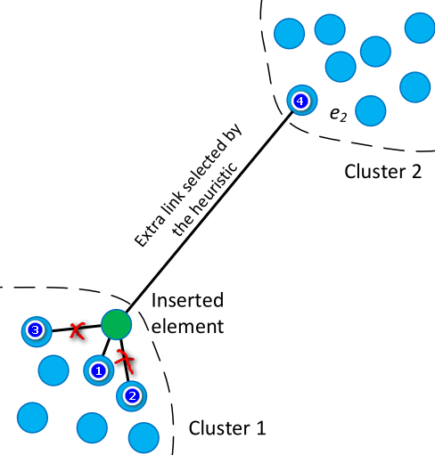
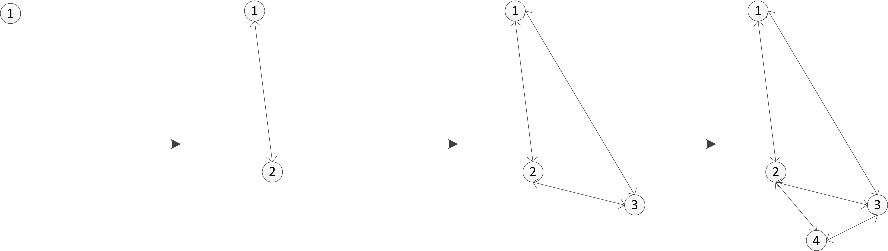
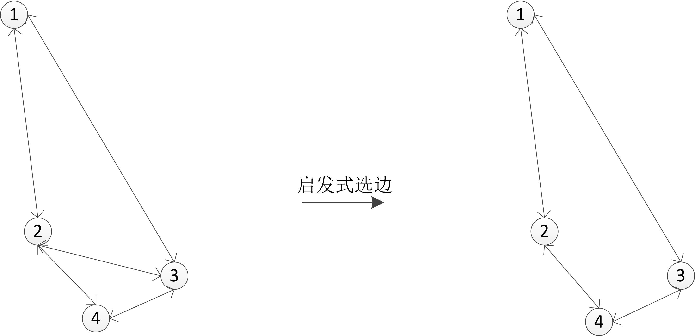
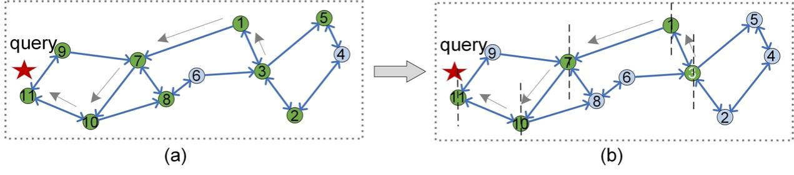

# 2.3.1 算法层面优化向量查询

从算法层面优化向量查询过程旨在通过减少向量距离计算次数和降低向量距离计算难度以提升向量查询性能，最终实现精度和效率的最优权衡。向量查询优化从算法层面可划分为两个维度：离线索引优化和在线搜索优化。

## 2.3.1.1 离线索引优化

给定一个向量数据集，我们可以为其构建不同的索引以满足不同场景对向量查询性能的要求。例如，对于内存空间有限的场景，量化索引和哈希索引可能是更好的选择，对于对查询精度要求较高的场景，图索引可能是更优的选择。对于不同索引的工作原理，请参阅向量索引小节的内容。本小节以图索引为例阐述离线索引优化如何影响查询性能。

当前，为高维向量设计的图索引已有10多种（KGraph, HNSW, NSG, Vamana等），在确保搜索策略完全相同的情况下，这些图索引之间的主要差异主要体现在邻接表。对于同一个向量，不同图索引具有不同的邻居连接情况。因此，现有的离线索引优化主要改进图索引构建过程的选边策略。比如，KGraph旨在构建一个$k$近邻图，即一个顶点尽可能连接距离它最近的一些顶点.然而，在HNSW中，一个顶点不仅连接距离它较近的一些邻居，还会通过启发式选边使得邻居的分布尽可能多样化。HNSW启发式选边的动机是：一个精确的近邻图不一定是最适合近似最近邻搜索的，适当添加一些长边会使在图上的导航过程更高效。下面通过一个示例来说明HNSW启发式选边的过程和优点。

**选边优化过程**

    
    
图1 HNSW启发式选边示意

如图1所示，绿色点是新插入的顶点，假设它的候选邻居集足够大能涵盖图中所有蓝色点，并且一个顶点最多只能连4个邻居。根据HNSW启发式选边规则，绿色点的最近邻居（图中编号为1的点）必连，接着检查第二近的邻居（编号为2），点2与绿色点的距离大于点2与点1（其实点2要与选中的点集中所有点都要比较选一个距离最小的，此时选中的点只有点1）的距离，因此绿色点与点2不连边。继续检查距离绿色点第3近的邻居（编号3），点3与绿色点的距离大于点3与点1的距离（可能不太明显，暂且这么认为），因此绿色点与点3也不连边。剩下的Cluster1中的蓝色点按到绿色点的距离由近及远重复执行上述操作，很明显，它们都不会与绿色点连边。

因为我们的候选邻居集足够大，下面开始评估Cluster2中的点是否需要与绿色点连边，先点4，它与绿色点的距离小于它与点1的距离（此时只选中了点1），因此选中点4，接下来Cluster2中的其它点重复上述操作都不会选中。经过启发式选边之后，绿色点选了两个邻居，分别是点1和点4，但是我们需要给插入点选4个邻居，还差2个，论文中的处理很简单，从丢弃的点里面选两个离绿色点最近的连边，即点2和点3。

**选边优化的优点**

先说一下它的一个明显的缺点，复杂了一些，肯定比只考虑距离的朴素选边策略构建复杂度更高，它多计算了一些距离。

为了更好的搜索性能，适当增加离线索引构建的开销也是值得的。启发式选边的优势主要有以下两点：

1. 尽可能地保证图的全局连通性，特别是数据集在分布上有很多聚簇时；
2. 长边起到“高速公路”的作用，使搜索过程可以快速收敛。

先说第1点，注意关键词“尽可能地”，这里的意思是，相比朴素选边（KGraph这种只选最近邻居的方式暂称为朴素选边），启发式选边在某些情况能保证图的全局连通性，但不保证所有情况。下面这个例子应该能清晰说明启发式相比于朴素式的优势，前者能保证全局连通性，而后者不能保证全局连通性。

    
    
图2 HNSW插入式图构建过程简化版（不考虑分层）

图2是HNSW简化版的插入式构图过程，假设每个点最多连两个邻居，插入过程为插入点选边也是按照启发式的策略，这里只给出结果，具体过程可自行分析，其实图2给出的例子启发式和朴素式选边的结果都是一样的。需要注意的一点是：HNSW给插入点选邻居时，在选中的邻居与插入点之间连接的是双向边，HNSW构建的是一个有向图。

插入点1，2，3都没什么问题，当插入点4后，点2和点3邻居数量超过2，需要裁边。裁边的时候采用的策略也是启发式的，裁边后的结果看图3，具体过程可按启发式的过程自行分析。

    
    
图3 启发式裁边

可见，经启发式裁边之后，全局连通性依然存在。如果用朴素选边呢？参考图4所示结果。

    
    
图4 朴素裁边

注意红色的线已经是单向边了。可见，无论从点2，点3还是点4出发，都不能到达点1了，全局连通不存在了。其实，对于某些情况启发式的裁边策略可能也不能保证全局连通性，这个时候朴素式的肯定是更不能保证的。

第2点“高速公路”没什么可说的，在裁边的机制下，朴素裁边很难保留长边。

根据以上分析，离线索引优化是通过减少向量距离计算次数（增加长边）来优化查询性能的。此外，由于启发式选边具有更好的连通性，因此离线索引优化也能提升查询精度。

### 2.3.1.2 在线搜索优化

不同向量索引具有显著不同的在线搜索过程，因此表现出不同的向量查询性能。在不同向量索引上的具体搜索过程可参考向量索引小节。本小节主要以当前应用最广泛的图索引为例阐述在线搜索优化对向量查询性能的影响。

给定一个导航图索引，在其上执行不同的搜索策略可实现不同的查询性能。就搜索策略而言，影响查询性能的因素有：（1）入口点选择；（2）路由策略；（3）终止条件。

**入口点选择**

入口点是指在图索引上开始执行搜索的起始点。研究表明，入口点的选择会直接影响搜索的效率和精度。比如一个距离查询点较远的入口点会增加在图索引上搜索的路径长度，从而增加访问的顶点数量，降低搜索效率。此外，距离查询较远的入口点也可能会增加陷入局部最优的概率，从而降低搜索精度。

当前研究有多种入口点选择优化的策略，比如通过一个额外的索引（树、哈希、采样图等）根据查询获取动态入口点。一些研究还提供了自适应获取入口点的理论和经验分析（具体请看参考文献7）。

**路由策略**

路由策略是指从入口点开始执行搜索至搜索终止这一过程的执行策略。实际上，现有的几种基于图索引的向量检索算法，如 HNSW、NSG，在整个路由过程中都采用直接的、贪婪的搜索作为路由策略。贪婪搜索虽然易于实现，但面临着路由效率低的问题。当用贪婪搜索在图索引上执行路由时，要访问的每个顶点的邻居将被充分探索。换句话说，贪婪搜索策略需要计算路由路径上每个顶点的所有邻居到查询的距离，这降低了搜索效率。如图5(a)所示，在访问顶点3时，我们需要计算距离d(2,q)，d (5,q)，d(1,q)。

    
    
图5 路由过程

为了解决这个问题，一种优化的导向搜索策略被提出，它只访问与查询方向相同的邻居以提升搜索效率。图5比较了在两种不同的路由策略中计算距离的次数: 贪婪搜索和导向搜索。给定一个查询 q (红星)和入口点(编号3) ，贪婪搜索在路由过程中访问9个顶点(图5(a)中的绿色顶点) ，而导向搜索只访问5个顶点(图5(b)中的绿色顶点)。导向搜索策略只访问顶点的部分邻居，它们集中在垂直虚线位于q的一侧。此外，一些基于机器学习的优化方法被用于改进路由过程，这些方法通常需要消耗更多的时间和内存。 最近，一些工作通过近似计算技术优化在图索引上的路由过程（具体请看参考文献8，9，10）。

**终止条件**

终止条件决定何时终止搜索过程。研究表明，在图索引上的搜索存在“长尾效应”，即某些查询虽然已获取到查询结果，但搜索过程迟迟不能终止，这可能导致高达90%额外多的顶点被访问。因此，设计合适的终止条件至关重要。一些研究通过机器学习算法在线自适应早期终止，另一些研究通过放松单调性优化图索引上的搜索终止。

根据以上分析，在线搜索优化主要从减少距离计算次数和距离计算难度实现查询性能优化。

### 参考文献

1. Malkov, Y.A. and Yashunin, D.A., 2018. Efficient and robust approximate nearest neighbor search using hierarchical navigable small world graphs. IEEE transactions on pattern analysis and machine intelligence, 42(4), pp.824-836.

2. Zhang, Q., Xu, S., Chen, Q., Sui, G., Xie, J., Cai, Z., Chen, Y., He, Y., Yang, Y., Yang, F. and Yang, M., 2023. {VBASE}: Unifying Online Vector Similarity Search and Relational Queries via Relaxed Monotonicity. In 17th USENIX Symposium on Operating Systems Design and Implementation (OSDI 23) (pp. 377-395).

3. Wang, M., Xu, X., Yue, Q. and Wang, Y., 2021. A comprehensive survey and experimental comparison of graph-based approximate nearest neighbor search. Proceedings of the VLDB Endowment, 14(11), pp.1964-1978.

4. Liu, J., Zhu, Z., Hu, J., Sun, H., Liu, L., Liu, L., Dai, G., Yang, H. and Wang, Y., 2022, June. Optimizing Graph-based Approximate Nearest Neighbor Search: Stronger and Smarter. In 2022 23rd IEEE International Conference on Mobile Data Management (MDM) (pp. 179-184). IEEE.

5. Fu, C., Xiang, C., Wang, C. and Cai, D., Fast Approximate Nearest Neighbor Search With The Navigating Spreading-out Graph. Proceedings of the VLDB Endowment, 12(5).

6. Li, C., Zhang, M., Andersen, D.G. and He, Y., 2020, June. Improving approximate nearest neighbor search through learned adaptive early termination. In Proceedings of the 2020 ACM SIGMOD International Conference on Management of Data (pp. 2539-2554).

7. Oguri, Y. and Matsui, Y., 2024. Theoretical and Empirical Analysis of Adaptive Entry Point Selection for Graph-based Approximate Nearest Neighbor Search. arXiv preprint arXiv:2402.04713.

8. Gao, J. and Long, C., 2023. High-dimensional approximate nearest neighbor search: with reliable and efficient distance comparison operations. Proceedings of the ACM on Management of Data, 1(2), pp.1-27.

9. Chen, P., Chang, W.C., Jiang, J.Y., Yu, H.F., Dhillon, I. and Hsieh, C.J., 2023, April. Finger: Fast inference for graph-based approximate nearest neighbor search. In Proceedings of the ACM Web Conference 2023 (pp. 3225-3235).

10. Jayaram Subramanya, S., Devvrit, F., Simhadri, H.V., Krishnawamy, R. and Kadekodi, R., 2019. Diskann: Fast accurate billion-point nearest neighbor search on a single node. Advances in Neural Information Processing Systems, 32.
