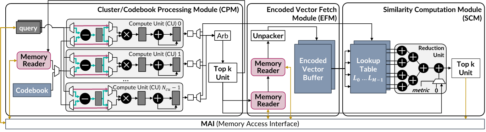

## 2.4.3 FPGA架构

FPGA（Field Programmable Gate Array）是一种可以通过编程来配置的半导体芯片设备。相较于通用的CPU或GPU，FPGA提供了高度的灵活性和并行处理的能力，因为它能够针对特定的应用进行硬件级的优化。FPGA由可编程逻辑块（Logic Blocks）、可编程互连（Interconnects）以及I/O块组成，可以实现复杂的数字计算任务。由于ANNS方案具有相对静态的控制流和易于抽象的并行性，传统CPU架构的动态控制流和动态指令级并行能力会给ANNS方案带来额外的功耗开销。并且，ANNS低计算密度的计算模式导致GPU的计算能力难以充分利用。而FPGA对于ANNS表现出独特的优势，特别是在需要处理大规模高维数据集，以及对延迟和吞吐量有严格要求的场景。
1. 定制硬件逻辑：FPGA允许开发者定制专用的硬件逻辑来实现特定的ANNS算法，以此来最大化数据处理的效率和速度。通过精细设计算法匹配的硬件结构，可以在保持高计算性能的同时，减少不必要的资源消耗。
2. 并行处理：FPGA天生支持高度并行的数据处理方式。在ANNS任务中，可以设计多个并行搜索路径或并行处理多个查询请求，这样大大减少了搜索时间，提升了吞吐量。
3. 流水线： FPGA可以实现数据处理的流水线(Pipelining)，这意味着在一个周期内，不同阶段的计算可以同时进行。对于ANNS来说，可以将数据预处理、搜索算法、结果聚合等步骤进行流水线设计，以此减少延迟，增加处理效率。
4. 动态重配置：FPGA支持允许时的动态重配置，使得在不同的应用场景下，可以根据需要快速地对硬件进行重新配置，适应不同的数据集或算法要求。
5. 成本效益：FPGA具有更低的功耗，针对特定应用优化的FPGA解决方案往往比通用计算平台更具成本效益，尤其是在维持长期运行的场景中。

下面介绍一种典型的基于FPGA的Two-level PQ-based ANNS架构——ANNA，如图所示。

ANNA的整体结构由三个模块构成，每个模块主要包含计算单元，Memory Reader和SRAM模块。CPM模块处理聚类的过滤和查找表的生成。图中的Memory Reader能够按顺序读取存放在主存中的中心点向量，然后这些被读取的向量会和存放在寄存器中的query查询向量分别计算相似性。计算的相似性结果会存放到途中的 Top K Unit中，这个模块会挑选出前K个最相似的聚类中心向量。对于每个查询的查找表构建，首先会从codebook中把codeword向量读取出来，然后和查询向量使用图中的计算单元进行相似性计算，计算的结果会存放到Lookup Table中。EFM模块使用Memory Reader从主存中读取选择的聚类中编码的向量，然后用unpacker硬件解压并存放在Encoded vector buffer中。相似性计算模块SCM会从encoded vector buffer 中读取编码的标识符并从查找表中检索出相应的值，然后输入到Reduction Unit中，用于计算在最终的相似性值。最后一步就是用 Top k Unit 把前k个最相似的向量筛选出来，Reduction Unit 中计算的结果会传递到 Top-k 选择单元中。然后最终的前k个被选择的向量会存放在内存中作为查询的最终结果

由于每个查询都需要分别构建一个查找表，这个过程可能会占用大量的运行时间。为了提高性能，ANNA通过双缓冲配置将CPM上的查找表构建和SCM上的相似性计算进行并行执行。假定PQ将原始向量生成了M个子向量，每个子向量生成了K个聚类中心，那么构建查找表时，需要依次读取这M个子向量对应的聚类中心，然后与query对应的子向量进行距离计算。为此，ANNA维护两个查找表的副本，并让CPM生成第（i+1）个子向量对应的查找表时，同时让SCM通过第i个子向量对应的查找表计算查询向量与向量之间的相似度。通过这种方式，查找表的构建时间与相似度计算时间可以重叠，有效地减少了总查询处理时间。

