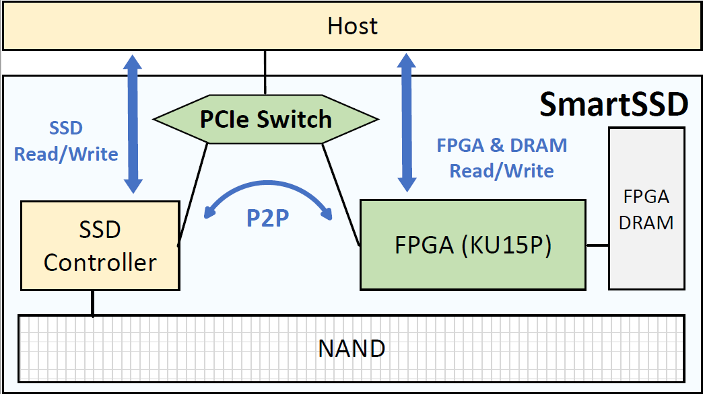
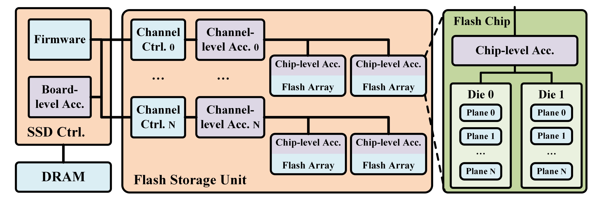

## 2.4.4 Near-Storage-Processing 架构

对于超大规模数据集，现有工作Diskann、SPANN等将索引数据存储在SSD中，以减少ANNS服务的成本。然而，这种传统的冯诺依曼架构存在固有的缺陷。在执行ANNS时，所有所需要的数据都需要从存储器传输到主机CPU中，这种大量的数据传输会导致性能显著下降。为了减少这种数据传输开销，基于近数据处理思想的近存储计算架构被提出用于加速大规模ANNS。该架构是基于移动计算比移动数据更快的思想，利用SSD内部的计算能力，直接在SSD中处理ANNS请求。这种方法不仅可以极大减少存储器与主机CPU之间的数据传输，还可以减少ANNS对主机CPU、Memory和PCIe总线的占用。

现有近存储计算架构主要分为两类，其中第一类是在SSD附近添加FPGA/ARM等计算单元，并在该计算单元与SSD之间添加可以直接通信的通道。三星公司的SmartSSD是该类架构的典型代表，其内部结构如图所示：

原始数据和索引均可以存放到底层的NAND Flash中。内置的FPGA可以通过编程实现各种ANNS搜索算法：HNSW，PQ等。当执行搜索时，主机向SmartSSD发送查询和对应的参数配置，SmartSSD接收到请求之后，调用内部的FPGA执行具体的搜索逻辑，FPGA可以直接通过内部的PCIe Switch对NAND Flash发起P2P Read和P2P Write请求。SSD Controller收到请求之后，可以直接将数据传输到FPGA中。其中，FPGA的片上DRAM可以作为NAND Flash的缓存，加速FPGA对数据的读取。SmartSSD完成搜索之后，只需要将最终的结果返回给主机。

第二类架构可以灵活配置SSD内部的各个部件，其内部结构如图所示：

同样地，原始数据和索引也是存放到Flash中。该架构与SmartSSD不同的是，计算单元分布在各个层面，包括：Board、Channel和Chip级别。以基于图的ANNS为例，整个搜索逻辑由Board-level加速器负责，当迭代地在图上进行遍历时，SSD中的每个Channel和Chip都可以并行地读取节点对应的邻居并计算与查询之间的距离。例如，当要处理节点A的32个邻居时，SSD控制器首先根据Firmware将这些邻居转化为对应的物理地址，然后再将请求发送给对应的Channel，每个Channel在内部就可以完成邻居的读取和距离计算。然后，计算得到的结果返回给Board-level加速器，结果整合之后再进行下一轮节点的遍历，直到满足终止条件位置。

第一种架构虽然实现了在SSD内部处理了ANNS请求，但是所有数据也都需要经过PCIe Switch传输，而第二种架构可以实现在Channel和Chip层面上完成读取和计算，减少了内部的数据传输。但是，第一种架构相比第二种架构在工艺实现上更简单，并且其通用性也更好。