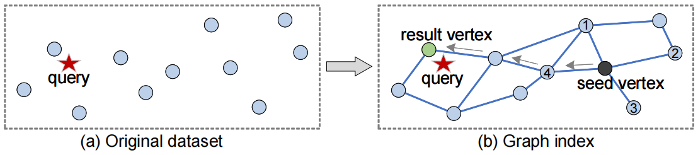
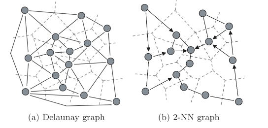
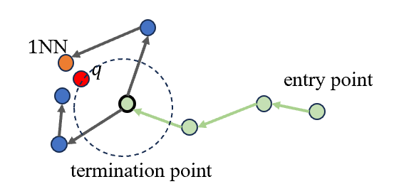
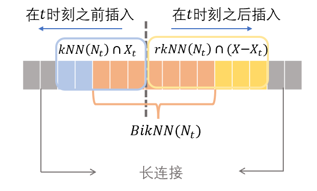
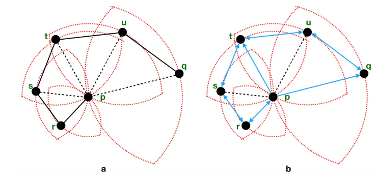
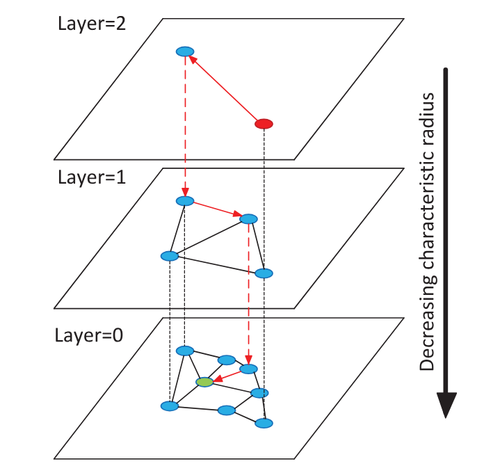

### 2.2.5 基于图的向量索引方法

基于图的向量索引是目前向量数据库中使用最广泛，查询性能最高的索引类型之一。
然而，图索引的发展历史并不如其他经典向量索引类型那样长。
最早用于KNN查询的图索引是KNN图，它的一种高效近似构建算法NN-descent在2011年被提出。
后续研究者将KNN图与小世界网络模型（small-world network）相结合，逐步开发出NSW，HNSW，NSG等索引，在深度神经网络输出的嵌入向量上获得显著的查询性能提升。
本章节以经典的KNN图和HNSW为例，介绍图向量索引的概念、原理和算法。

#### 2.2.5.1 概述
基于图的向量索引将数据集中的每个向量表示为图中的一个点，同时根据向量间的距离（或称为相似性）为图赋边。不同图索引结构主要指不同的赋边策略。现代图索引多为有向图，也有部分为无向图。若图中存在一条边从节点a指向节点b，我们称节点b是节点a的邻居节点。


图索引的设计动机来自于小世界网络模型中的六度分隔理论。举一个通俗的例子，在人类社会的社交网络中（网络中的边为社交关系），从任何一个节点出发，在6步之内可以到达大部分网络中的节点。那么若以类似的方式将向量组织成网络（图），便可以从任意入口点出发，在较少步数内，到达查询点的最近邻。


<div align=center>
<p>图2.1 图索引的一个例子</p>
</div>

受小世界网络模型的启发，图索引也设计了贪婪的查询算法。如图2.1，给定一个查询点（query），图索引会选定一个入口点（entry point），然后从其邻居节点中选择最靠近查询点作为下一步。重复此过程，当前点会逐步靠近查询点，并最终收敛，即，当前点比所有的邻居点更靠近查询点。该算法通常也被称为“最佳优先搜索”（best-first-search）。注意，算法收敛后得到的节点向量并不总是精确的最近邻，即收敛到了局部最优（local optimum）而非全局最优（global optimum）。因此，图索引查询算法往往不能提供结果的精度保障。但是，在某些特殊的图结构中，可以证明算法找到的局部最优即为全局最优。


图索引的查询代价通常由距离计算次数度量。在贪婪查询算法中，查询代价由两部分构成：搜索路径长度，和平均邻居个数。在搜索的每一步上，需要计算邻居节点和查询节点之间的距离。这引出了图索引结构的一个重要设计权衡：稀疏性—导航性权衡。总的来说，图越稀疏，每一步的计算代价越低，算法效率越高；相反，图越稠密，从入口点到达最近邻点的期望路径长度越短，算法效率越高。因此，为实现最优的查询性能，图索引的设计需要在稀疏性和导航性之间寻取一个最优的平衡。


注意上述查询算法是在$k=1$时的简化版本，且无法通过参数控制精度和效率的权衡。我们将在下一节中介绍$k>1$的场景和集束搜索的扩展。尽管如此，上述分析同样适用于扩展搜索算法。


#### 2.2.5.2 KNN图

##### 2.2.5.2.1 索引结构

顾名思义，KNN图中，每个节点指向其K个最近邻。注意，最近邻关系不是对称关系。也就是说，若节点A是节点B的最近邻，节点B不一定是节点A的最近邻。因此，一般来说，KNN图是有向图。


KNN图通常认为是Delaunay图的一种近似，而Delaunay图可以保证使用贪婪搜索算法可以找到精确最近邻。如图2.2 (a)，Delaunay图（实线部分）和Voronoi图（虚线部分）在几何上是对称关系。


以二维平面为例，将数据集中的点（即图中灰色点）视为锚点，若其它某一未知的点距离锚点A比其它锚点都更近，那么这一位置视为归属于锚点A的Voronoi网格。图2.2 (a) 中各个虚线围成的多边形即为各个锚点的Voronoi网格。锚点必定会位于自己的Voronoi网格内。


若两个锚点的Voronoi网格是相连的，在Delaunay图上会为这个两个锚点之间连边。注意到，在几何上，若两个锚点之间直线相连，得到的边将“垂直平分”两个Voronoi网格的边界。直观上说，在Delaunay图上，节点会连接在各个方向上和自己最靠近的点作为邻居。因次，在KNN图中，节点通过连接和自己距离最近的固定K个邻居来模拟近似Delaunay图。



<div align=center>
<p>图2.2 Delaunay图与KNN图</p>
</div>

尽管Delaunay图有着精确的查询保障，但其在高维空间上趋近于完全图，不仅带来极高的构建代价，而且不具备稀疏性，导致较差的实际查询性能。因此，对Delaunay图做度数限制或其它近似手段（如KNN图）是更为常见的图索引设计方法。KNN图在公开数据集上表现出了优越的查询性能，但是，包括KNN图在内的现有大部分基于Delaunay图的图索引，通常是Delaunay图的子图，已经失去了精确查询保证。这意味着尽管它们获得了较好的实际性能，但仍然缺少理论基础。


##### 2.2.5.2.2 查询算法

本节介绍KNN图的近似$k$NN查询算法。此算法是2.2.5.1节的扩展版本，同时适用于目前大部分先进的图索引。


代码2.1展示了搜索的主要过程。贪婪查询算法的核心是通过维护一个定长为$L$（$L$≥$k$）的优先级队列$C$，来保存目前找到的最靠近查询点的数据点，并以此确定查询路径的下一步的节点。

具体来说，队列$C$中的项包含三个信息，数据点，数据点到查询点的距离，以及数据点是否已在队列中被访问过。队列$C$按照数据点到查询点的距离由近及远排序。$C$初始化时加入入口点$ep$。

另外，为避免搜索时冗余的距离计算，算法额外维护一个集合$V$，存储探测过的节点（计算过与查询点的距离）。同样，$V$初始时加入入口点$ep$。

算法的核心逻辑是7-15行的循环过程，循环每次访问队列$C$中一个未访问过的节点$vp$，探测$vp$的邻居节点并加入到队列中。探测结束后，若队列中超过$L$个点，则将当前队列中距离查询点最远的一些项丢弃，仅保留最靠近查询点的$L$个点。

当队列$C$中所有节点均已访问过时，算法收敛，循环结束。此时，意味着所有在查询路径上探测过的节点距离查询点的距离都比队列$C$中留存下来的点要更远。最后，算法将队列$C$中前$k$项中的节点返回给用户。

<div align=center>
<p>代码2.1：图的近似KNN搜索算法</p>
</div>

```pseudocode
approx_kNN_Graph_Search(图 G, 查询点 q, 入口点 ep, 参数k, L)

> 初始化一个空的优先级队列C，C中每一项的形式为(点, 点到查询点的距离, 是否已访问)。 C中的项按照距离从小到大排序。
> 将(ep, δ(ep, q), false)加入C。
> 初始化一个空的集合V，代表已探测过的节点。
> 将ep加入V。
> While 存在C中的项没有访问过：
>	令p=(vp, δp, ap)为C中第一个未访问的项（即ap = false）
>   ap = true
>   For n ∈ G[vp]：
>		if n not in V:
>			将(n, δ(n, q), false)加入C。
>			将n加入V。
>   if |C| > L:
>		截断队列C，仅保留前L项。
> 返回C中前k项中的点。
```



<div align=center>
<p>图2.3 图索引算法查询时的局部最优解</p>
</div>

讨论：

1. 搜索路径：在$k$NN的搜索过程中，搜索路径并非如图2.1所示意的是一条单向路径。实际的搜索”路径“是一棵树，搜索算法可能沿着多个方向尝试寻找结果，最终返回的$k$个结果也可能由来自多个方向的数据点拼凑成。注意到贪婪搜索算法通常称为”最优优先搜索“（Best-First-Search），而非广度优先搜索（BFS, Breadth-First-Search）。
2. 局部最优：在KNN图上，贪婪算法不能确保找到的结果是全局最优的。算法可以保证访问过的点的一阶邻居到查询点的距离是更远的，但无法保证二阶邻居（即，邻居的邻居）和高阶邻居的情况。因此，贪婪算法可能陷入局部最优。
3. 精确性-效率权衡：在ANN索引算法中，通常可以通过参数来控制搜索力度。更大的搜索力度会延长查询时间，同时提高查询精确性。在贪婪搜索算法中，参数$L$，即优先级队列$C$的容量，代表搜索力度。更长的优先级队列可以允许访问更多点，也有更大的机会逃离局部最优，获得高质量的结果。但是，$L$和搜索力度（或查询时间）并不是线性关系。也就是说，增大1倍$L$可能导致查询时间延长2倍，需要根据实际情况确定。在工程实现中，通常将贪婪算法做变种，引入一个额外参数来限制查询的最多步数，以此来控制稳定的查询时间。


##### 2.2.5.2.3 近似构建算法

构建精确的KNN图需要精确寻找每个数据集中节点的K个最近邻，为了降低这个精确查询的代价，KNN图一般以近似的方式构建。本节以著名的NN-descent算法为例，介绍构建近似KNN图的基本原理。


NN-descent算法的核心思想可以由一句话概括：”我邻居的邻居也可能是我的邻居“。也就是说，假设已经存在一个近似KNN图，我们可以通过访问当前节点的邻居的邻居，来更新提升当前节点的邻居列表。因此，近似KNN图可以通过迭代-优化的方式逐步构建。具体来说，NN-descent算法包含以下几个步骤：

- 初始化：通过随机选点初始化一个KNN图。
- 迭代：
  - 对于数据集中每一个点v，从图中取得它的K个邻居，以及若干反向邻居（把v当做邻居的节点），合并为集合B；
  - 对于B中的每一个点u，在图中取得其K个邻居以及若干反向邻居，合并为集合B';
  - 计算v和B'中每一个点的距离，尝试更新v的邻居列表。
- 终止：若一轮迭代，没有产生任何一次更新，算法收敛终止。


对NN-descent算法有许多有效的优化算法：

- 局部连接：将探测二阶邻居转化为一阶邻居之间互相探测，即“我的邻居互相之间也可能是邻居”。这种方法没有改变比较次数，却降低了从图中寻找邻居的代价。
- 初始化：可以通过一个初步快速的，低精度的索引（比如kd树）来做KNN图的初始化，加快算法收敛。
- 冗余计算避免：随着迭代的进行，某些相邻点可能会多次计算距离导致冗余，可以通过加标记来减少冗余计算。


#### 2.2.5.3 导航图索引

本节将介绍一类图索引，即导航图（navigable graph）索引，在某些文献中也称之为邻居图（neighborhood graph）。这一类索引中包含了目前查询性能最优的方法，比如层次化可导航小世界图（Hierarchical Navigable Small World Graphs, HNSW），导航展开图（Navigating Spreading-out Graph）等。

导航图是基于KNN图和小世界网络模型，通过近似的启发式设计而成，其本质上仍然主要以局部最近邻的连接为主。在本节中，我们首先简要介绍小世界网络模型，再逐步将其设计原则引入到实际的图索引中。由于本节中介绍的图索引的查询算法均为2.2.5.2.2中介绍的算法的变种，我们将略过其细节而重点关注索引结构与查询算法。


##### 2.2.5.3.1 小世界网络模型

给定图上的一条从起点到终点的搜索路径，如果路径中的两点可以有一条与路径方向相同的边，那么通过这条边就可以找到一条通往重点的“捷径”，进而缩短路径，提高查询速度。

小世界网络模型研究的问题就是如何在图中加一些更长的边（即，两点之间距离较远）使得贪婪算法能够更快的找到终点（即，搜索路径更短）。这个问题在通讯、社交网络等领域中有着广泛的应用价值。


<div align=center>
<p>图2.4 二维晶格图上的小世界网络模型</p>
</div>


小世界网络模型的研究从二维晶格图开始。在这个图中，数据点之间的距离通过曼哈顿距离（L1距离）度量，距离不超过$r$的两点之间连接一条边。在此基础上，小世界网络又基于概率模型引入了一些随机边。对于一个给定点$u$来说，距离$u$越远的点，连边的概率越小。赋边的概率随着距离增大而指数下降。可以证明，在一定参数条件下，在二维晶格图上的小世界网络执行贪婪搜索算法，其搜索步数是多重对数级别的，即$O(log^2n)$，其中$n$是数据集大小。这个结论可以在一定条件下，扩展至高维空间上。


受到小世界网络模型启发，研究者对KNN图进行近似改造，通过引入长连接来降低期望搜索路径长度，通过限制节点邻居个数来降低搜索中每一步的计算代价，最终得到了具有现实意义的图索引。


##### 2.2.5.3.2 可导航小世界图（NSW）

最先引入小世界网络模型概念的是可导航小世界图（Navigable Small-World Graph, NSW）。NSW没有直接在KNN图上随机引入长连接，而是以一种巧妙的方式将长边在构建过程中间接引入。

NSW是一个无向图，它是通过逐个插入数据点的方式构件图结构。具体来说，当插入一个点$v$时，NSW在已插入的点中通过贪婪搜索，找到近似的$K$个最近邻，然后在$v$和这$K$个最近邻之间建立边。


在NSW中，越先连接的边越有可能成为长边：在索引构建的前期，仅有少量数据点插入，因此在这部分数据点中找到了的最近邻，可能和在整个数据集上的真实$k$NN相差很大，也就构成了长连接。

相反，对于后插入的点，此时大部分数据点已经插入数据集，假设贪婪搜索是精确的，那么该点的邻居将主要是该点的真实$k$NN，即短边为主。一个极端情况是最后插入的点，它的邻居就是真实的$k$NN。

换句话说，NSW的图结构和数据插入顺序关系非常密切，不同的插入顺序将带来截然不同的连接方式。因此，通常在索引构建之前随机排列数据集。实验表明，随机排列后的不同插入顺序带来的平均查询性能是非常接近的。




<div align=center>
<p>图2.5 NSW的节点邻居构成</p>
</div>

图2.5显示了一个在时刻$t$插入的节点$N_t$的邻居列表的构成，其中$X$代表数据集中的所有点，$X_t$代表在$t$时刻之前插入的数据点，$rkNN(N_t)$代表反向$k$NN，即以$N_t$为$k$NN的点，$BikNN(N_t)=kNN(N_t)\cap rkNN(N_t)$代表双向$kNN$。

可以看到，相比于KNN图，在NSW中，$N_t$的邻居构成除了一部分最近邻（蓝色和橙色方块），还包含一部分反向$k$NN（黄色方块），这部分边由后插入的点连接引入；以及一部分非$k$NN且非$rk$NN的点，这部分的边是由于NSW的“局部插入策略”（即只在已插入点中寻找$k$NN）和贪婪搜索的不准确性引入的。


NSW通过高效的方式将局部短边和长连接同时引入图索引中，尽管不严格符合小世界网络模型中的指数概率分布，但在实际数据集中获得了显著的性能提升。

然而，由于先插入的点更多地被曝光在后续插入点的搜索过程中，这些点往往会有更大的度数，而更大的度数意味着在访问这个点时需要更大的计算代价，这在另一个方面影响了索引的查询性能。


##### 2.2.5.3.3 层次化可导航小世界图（HNSW）

HNSW是NSW的一个改进版，引入了层次化的索引结构。在本节中，我们首先介绍HNSW的扁平图结构（即第0层），然后介绍其层次化的索引结构设计。

和NSW相同，HNSW也是通过逐个插入点的方式来构建图索引，也通过在已插入数据上通过贪婪搜索找$k$NN的方式位图赋边。与NSW不同的是，HNSW是有向图，且限制每个点的出度最大为$2M$（$M$是用户定义的参数）。为了满足这一条件，需要合理分配出度槽位。具体来说，HNSW在插入点时只为这个点填充$M$个最近邻，而留下另$M$个空位。尽管HNSW是有向图，但在插入点并为之赋边时，赋予双向边。若邻居的出度本来不足$2M$，则可以直接添加边，否则就需要启动裁边策略，从$2M+1$个邻居中筛选至多$2M$个邻居。



<div align=center>
<p>图2.6 (a) RNG (b) MRNG</p>
</div>

如图2.6，HNSW的裁边策略源自于相对邻域图（Relative Neighborhood Graph, RNG）。RNG是一个无向图，可以认为是Delaunay图经过裁剪后的子图。简单来讲，RNG会移除图中所有三角形的最长边。通过这种方式，RNG不能保持Delaunay图的导航特性，但可以获得其弱化的性质，若查询点为数据集中点，则通过贪婪搜索仍然可以找到此查询点。


MRNG将RNG改造为有向图，并弱化了边的排斥条件，引入了更多的连接。具体来说，若有向边（$p$, $q$）属于MRNG，则要么以（$p$, $q$）为轴的月牙形区域内没有点，要么此区域内的点$r$没有和点$p$构成边（$p$, $r$）。通过这种方式MRNG降低了贪婪搜索路径的期望长度，我们在此省略证明。


从另一个角度来讲，无论是RNG还是MRNG，都是在Delaunay图的基础上考虑了邻居的角度分布。换句话说，若两个邻居点$q$, $r$,在当前点$p$相同或相近方向上，即使它们都和当前点距离很近，也只会保留一条边（比如说边（$p$, $q$）），而到另一个点$r$的可达性可以期待通过边（$q$, $r$）来完成。


在HNSW中，引入了MRNG的裁边策略。在实现中，给定当前点$p$，将所有候选点按照与$p$的距离从近及远排序。当检验某一候选点$r$时，查看是否存在某一个已插入边的候选点$q$，使得$\delta(p,r)>\delta(q,r)$。若存在，则跳过$r$；否则插入边（$p$，$r$）。若$2M$个槽位已满，则终止插入。通过这种方式，HNSW在图的稀疏性和导航性之间做出了权衡。具体来说，通过限制最大出度，保证了稀疏性；通过KNN图，长连接引入和MRNG裁边策略，期望获得导航性。




<div align=center>
<p>图2.7 HNSW的层次化结构</p>
</div>


在HNSW中另外一个设计是层次化结构。如图2.7，HNSW从全量图中抽取一部分数据点到上一层，独立构建图；然后再从这个子集中抽取一部分到再上一层构图，依次类推直到数据点足够少。设计直觉是稀疏的上层图可以将查询点快速导航至$k$NN点的周围，通过这种方式为全量图的贪婪搜索提供一个更优的起始点。然而，后续研究者发现，HNSW的层次化结构仅在低维数据集上（<16维）可以提供性能增益。其原因在于实际在近邻图索引中，查询点从入口点导航至$k$NN周围的速度是很快的，在$k$NN周围探测寻找的速度反而更慢，因此HNSW的层次化结构针对的性能增益空间是较小的。


##### 2.2.5.3.4 基于磁盘的图索引

本节中介绍的图索引主要是内存索引，即数据与索引结构在构建和查询时可以驻于内存。当数据集增大到内存无法容纳时，磁盘索引就是必要的。在本节中，我们以DiskANN索引为例，介绍磁盘的图索引的设计原则。


和内存索引不同的是，磁盘索引的查询性能不仅决定于计算代价，还决定于磁盘I/O的次数。然而由于贪婪搜索中图的访问模式是随机访问，即每一跳都需要随机访问若干不同节点，因此在给定图的出度前提下，降低搜索路径长度变得尤为关键。


为了解决这一问题，DiskANN首先从图的连接方式上作出优化。首先为了控制图的直径，即最远两个点之间的跳数，DiskANN将MRNG的裁边条件进行放松，将裁边条件式$\delta(p,r)>\delta(q,r)$中引入一个参数$\alpha \geq1$，改为$\delta(p,r)>\alpha\delta(q,r)$，使得在图的构建过程中可以引入更多的邻居，降低了搜索路径的长度，进而减少了查询时的磁盘I/O次数。


注意到，如果从内存索引的视角来看，降低搜索路径长度并增加邻居个数不一定意味着搜索效率的提升，因为实际的查询代价由二者共同决定。而在磁盘索引中，搜索路径长度不仅影响计算代价，而且决定了磁盘I/O次数，因此对查询效率的影响更为重要。


在实际的构建算法中，DiskANN采用了两轮构建的策略。第一轮令$\alpha=1$构建常规图，在第二轮令$\alpha>1$缩减期望的搜索路径长度。主体的算法流程上，DiskANN和HNSW等图索引是相似的，我们在这里不再赘述。


构建磁盘索引的另一个问题是内存限制。本节中描述的构建算法均默认原始数据、图索引结构及其它构建时用到的辅助数据结构可以存放于内存，当内存有限制时，应该如何构图呢？DiskANN提供了一种分治的策略。当处理大数据集时，DiskANN首先通过K-means聚类算法找到$K$个聚类中心；对于每一个聚类中心，DiskANN把$l$个和其最近的簇分配给它。


索引构建时每次只处理一个聚类中心，即将$l$个簇的数据取至内存，构建图索引，然后存于磁盘中。最终在将所有的小图索引合并形成大索引。在查询时，原始数据、索引结构均存放于外存。进一步，在DiskANN中，为了避免每一跳访问所有邻居造成大量I/O，会在内存存放原始数据的乘积量化码（见2.2.3节），在搜索过程计算距离时使用量化码在内存进行近似距离计算，即可避免访问原始数据造成I/O。在搜索收敛，算法返回结果之前，可以将搜索到的候选结果从磁盘中取出，计算精确距离并返回最终$k$NN。


#### 2.2.5.4 总结

在本节中，我们介绍了图索引的设计动机、查询算法和典型的图索引结构。总的来说，图索引的设计基于直观的启发并有着简洁易于理解的构建算法，并且在实践中取得了非常突出的查询性能。

然而，作为一个近十几年来发展起来的方法，其在理论层面还有着不少的空白。比如，算法评估中最重要的复杂度分析（最坏情况与期望情况），作为近似算法的精确性分析，目前尚缺乏明确的结论。

此外，从实践层面中，如何提升图索引的可伸缩性，降低构建索引时所需的时间和空间成本，降低在不同查询中的性能方差，以及在更复杂场景中的应用（包括动态数据集，分布式与云上数据库）也是值得进一步研究的问题。
