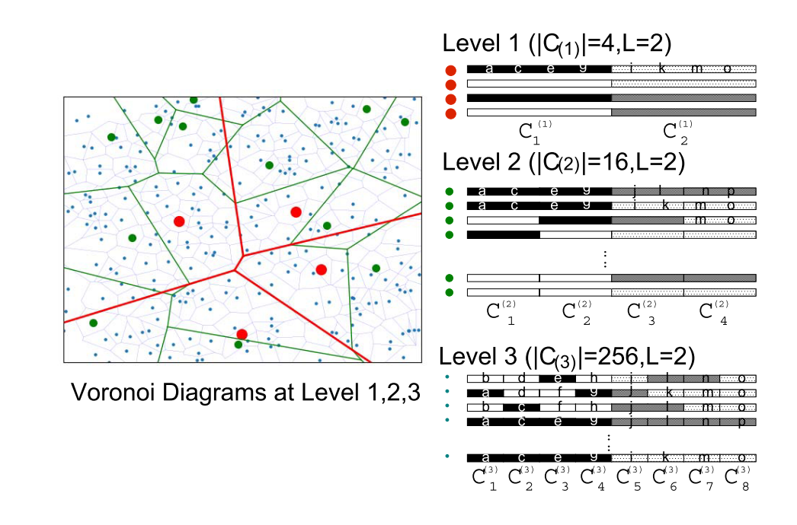

# 2.2.6 基于混合结构的向量索引方法
上文介绍了四类近似最近邻索引算法，但这些算法在不同的场景下各有优劣。例如，图索引的构建成本问题、量化索引中不可避免的量化损失问题、树索引在高维向量空间中的效率下降问题等等，于是近几年的很多工作逐渐关注于混合结构的近似最近邻索引算法，通过融合不同种类的索引算法来弥补各自的缺陷问题。例如将PQ索引和图索引结合或树索引和图索引结合等等。在这类方法中，我们通常可以将完整的向量搜索过程划分为两个阶段。第一个阶段以更小的代价来缩小查询范围，第二个阶段在一些更可能包含近邻的区域执行检索。本章节将会选取几个有代表性的两阶段索引算法来介绍它们的原理。

## 2.2.6.1 概述
以目前性能表现比较好的HNSW为例，HNSW在NSW的基础上受跳表的思想启发，提出了多层的可导航小世界图模型。我们也可以将其搜索过程划分两个阶段。第一个阶段是所有非0层的检索，在这个过程中希望通过跨层的快速路由来为第0层的检索选择一个入口节点。如果入口节点距离近邻区域比较近，那么可以有效的减少搜索路径的长度。这也可以理解为快速的逼近目标区域。第二个阶段即为在第0层执行贪心搜索。对$k$近邻进行召回。事实上，在一些工作中认为在搜索的早期阶段，精准距离计算的的成本太高。为了克服这一限制，一些工作继续放大两阶段的特性。例如在HVS中，作者提出了一种多层PQ图结构来代替HNSW的非0层，以更小的成本进行索引的构造和搜索。Elpis针对时序数据提出使用时序索引树Hercules作为第一阶段索引算法。在这些工作中，通常选择图索引作为第二阶段的索引算法。这类方法我们可以统称为基于数据特征的空间划分策略指导的两阶段索引算法。还有一类以DiskANN为例，解决的主要问题是大规模数据集下，减轻索引对内存的依赖问题。为了解决这个问题，提出以图索引和量化索引进行结合，通过这种方法可以将索引结构保存在SSD中，内存中只保存体积相对较小的压缩向量。下面，我们会用两个小节分别介绍这两类算法。

## 2.2.6.2 效率优化
以效率优化为目标的这类混合结构索引方法中，主要的优化点在于降低粗搜阶段的构建和搜索复杂度。在HVS中，作者提出了用层次化的空间分隔方法来减少搜索的早期阶段做精准距离计算的时间开销。HVS使用了多级乘积量化算法充当了第一阶段的检索方法。  

多级乘积量化的特点体现在可以构建均匀的分区。具体的实现思路是自底向上构建分区。首先在最低层构建充分稠密的Voronoi图，即将最底层的PQ索引中子向量聚类中心个数$L$和分段数$m$都设置的较大，然后逐层向上抽取部分聚类中心，文中将这些点表示为seed point，这样上层聚类中心的数量就会逐层递减。像图中这样我们固定每一层的子码字个数为2，从1到T层的分段数为（$2$,$4$,$8$,……,$2^T$），聚类中心个数为（$2^2$,$2^4$,$2^8$,……,$2^{2T}$），分区密度自上而下是按照指数递增的（图中红色区域为最上层）。

在HVS中选择自底向上逐层的选择聚类中心合并，一方面因为如果每层都去重新构建PQ索引，那么构建和搜索的开销也会随之增加。而如果自底向上的合并，子码本可以重复利用，且在每一层搜索时也规避了查询向量多次和不同的码本距离计算的开销。这类方法的核心思路就是用量化、树等结构来牺牲可接受的精度来换取更高的构建和检索效率。

## 2.2.6.3 内存优化
SPANN是一种针对上亿向量近似最近邻检索的算法，它采用内存和硬盘混合存储的策略。SPANN基于平衡聚类树设计，能够有效地将相似的向量以小规模聚类集合的方式连续地存储在磁盘上，通过加载有限个数的聚类集合来减少磁盘访问。  
具体来说，在第一阶段通过平衡K-Means树算法将相互靠近的数据聚类到一起，并使用中心点来表示该聚类集合。在搜索过程中，首先会找到与查询向量靠近的多个聚类集合，然后在多个聚类集合中进行第二阶段的搜索，因此能够避免对整个向量检索引擎中的数据进行搜索。

为了提供高效的磁盘访问，SPANN 在索引构建和检索过程进行了优化。它使用了多层级的负载均衡的聚类算法，生成大量的聚类集合来减少总的向量检索的数据搜索数目。并且限制了每个聚类的规模，使每个聚类大小尽可能地均匀，来最小化不同的查询向量的访问开销的方差。
为了解决聚类过程中边缘点问题导致的召回下降，SPANN 选择将聚类中的边缘点冗余放置到多个相近的聚类集合中，来增加这些向量的可见性。另一方面，SPANN 在对查询向量检索时实现动态剪枝，减少了磁盘访问的次数。
总的来说，相比于传统的两阶段IVF-HNSW方法，SPANN在构建的过程中使用均衡多层聚类算法来保证了空间划分的均匀性且通过将边缘点放置到多个集合中来解决边界问题。在搜索的过程中，通过动态剪枝策略来针对每个查询选择不同的召回聚类的数量来提升平均的检索速度。从实验中可以看到，其在磁盘索引的性能是优于DiskANN的。

## 2.2.6.3 总结
在本章中，我们介绍了两类不同优化目标的混合结构的索引方法：效率优化和内存优化。效率优化方法如HVS，通过使用多级乘积量化算法降低粗搜阶段的构建和搜索复杂度。内存优化方法如SPANN，通过使用内存和硬盘混合存储策略，有效地将相似的向量以小规模聚类集合的方式连续地存储在磁盘上，减少磁盘访问。  

混合结构的索引方法为我们提供了一种新的、灵活的方式来处理近似最近邻搜索问题。它们通过融合不同的索引方法，能够在不同的场景下提供更好的性能。然而，这些方法也带来了新的挑战，如如何选择和组合不同的索引方法，以及如何调整和优化它们的组合参数。这些问题需要在实际应用中根据具体的需求和环境进行考虑和解决。