### 2.2.4 基于树的向量索引方法

基于树结构的向量索引是向量索引中最经典的一类方法，其起源于数据库中的多列索引，逐渐延伸到高维向量数据上。空间对象、轨迹、时间序列的相似性索引往往也采用了树形结构，针对不同的数据分布，设计了对应的结构。

基于树的向量索引构建效率高，可伸缩性强，有充分的理论基础支持。此外，树索引原理简单，实现容易，在实际应用中受到的限制更少。通常来说，树索引可以支持精确的最近邻查询，许多树索引还可以支持索引在磁盘中的数据。

本节通过介绍三类典型的树索引，介绍其设计思想、原理和主要算法。

#### 2.2.4.1 概述

基于树的向量索引的核心思想是空间分区，即将数据集所处的高维空间通过合适的方式以层次化的方式分割成若干小的分区，每个分区包含一个或一部分数据点。在查询时算法首先定位到最接近查询向量的若干分区，然后取出分区中的向量，和查询向量计算距离，筛选出和查询向量最近的k个向量作为结果返回。

从查询过程可以看出，决定树索引的查询性能有两个因素，一个是分区的质量，这决定了查询时和查询向量接近的分区中是否包含真正的最近邻向量；另一个是在树索引中路由的速度，这决定了算法定位最接近分区的速度，因而影响了查询的效率。在这种情况下，不同的树索引之间的核心区别即为分区的方式不同。

通过空间分区的方式构建索引的一个优势是索引的分区往往可以提供距离的上下界。如后文所介绍，目前流行的树索引的分区通常为超矩形、超球形或者Voronoi Cell等已充分研究的空间几何体。这些分区和查询向量之间的距离如果过远（即下界过大），则可以跳过搜索这些分区，且保证不会遗漏任何真实最近邻。这一性质使得树索引可以支持精确查询。

通过空间分区构建索引也存在缺陷。考虑查询向量位于一个分区的边界附近，此时邻近分区也很可能包含和查询向量距离很近的点，但却不能首先被访问到；查询向量所处分区的点可能离查询点反而很远，却要优先访问。这个边界问题在高维数据上表现的尤为明显，因为在高维空间中邻近的分区数随维数以指数增长。另外，由于目前人们对于高维空间中的数据分布的了解并不成熟，如何构建出更高效的数据分区方式（比如分区形状）也是一个有挑战性的问题。

由于发明较早，树索引的类型异常繁多难以枚举，因此在本节中，我们将树索引基于其设计原理分成三类，基于超平面分区的，基于锚点的和基于降维策略的树索引，并列举其中的代表性方法和优化策略，以帮助读者理解其中的主要思想。

#### 2.2.4.2 基于超平面分区的树索引

基于超平面进行分区的索引通过在高维空间构建一个平面，将数据（子）集划分到平面的两侧，再通过树形结构不断重复此过程。其最终结果是根据数据分布，将高维空间划分成若干分区，每个数据点属于其中的一个分区。

k-d树及其变种是专门为高维向量数据检索而设计的，也是这一类索引中最具代表性的，本节将以k-d树开始，介绍此类索引的设计理念和工作原理，并逐步引入相关的优化策略。此外，空间索引如R-tree家族也可以划分为此类，但由于R-tree原生是为2维或3维空间对象所设计，在高维数据中性能退化明显，我们将不再本书中讨论。

##### 2.2.4.2.1 k-d树

k-d树 (k-dimensional tree)是最经典的树索引之一。其基本结构是一个二叉树。索引从一个包含整个数据集中点的根节点开始构建，若当前节点的大小（即，包含向量个数）超过一个给定的阈值$th$，则当前节点将分裂为两个子节点。依次类推，直到所有节点的大小都不超过$th$，索引构建完成。

决定kd-tree查询性能的一个重要因素是（中间）节点的分裂策略。最简单的一种分裂策略是以循环的方式每次选择一个维度$d_i$，计算节点中的向量在$d_i$上的中值$mid_i$，基于这个中值将数据平均分成两个子集，作为两个子节点。其中，在维度$d_i$上小于等于$mid_i$的被划为左孩子节点，大于$mid_i$的被划为右孩子节点。这个分裂过程也可以视为用一个垂直于$d_i$的超平面将空间切割

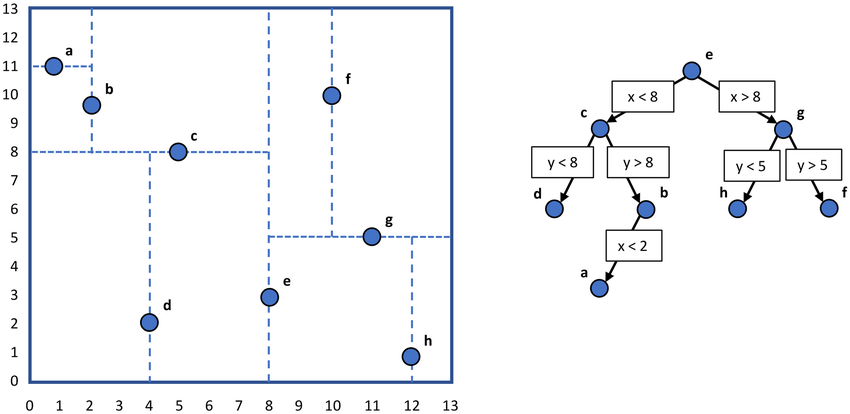

图2.1 一个二维k-d tree的例子

k-d树的查询有两种方式。

第一种方式是回溯。算法首先从k-d树的根节点开始，根据节点的分裂维度、分裂中值和查询向量对应维度的值决定向下访问哪一侧的孩子节点，依次类推，直到找到目标叶子节点，其对应的空间分区可以容纳查询向量。然后检查目标叶子节点中的向量和查询向量的距离，维护在一个堆里。

算法的第二步是自底向上，从目标叶子节点开始，沿着第一步的节点访问路径，逐层向上回溯。若未访问的兄弟节点可能存在比堆中点距离更近的点，则以此兄弟节点为根节点，重复查询算法；否则跳过而继续向上回溯。

当回溯至根节点时，算法终止。

另一种方式是使用优先级队列。类似地，算法从树的根节点开始逐层向下查找，与回溯法不同的是，此算法会在向下查找的过程中维护一个优先级队列，存放所有访问过的节点，并按照节点和查询向量的下界距离进行排序。

从根节点开始，算法每次从优先级队列中出队一个节点，若为中间节点，则将其两个孩子节点计算距离并置于优先级队列；若为叶子节点，则计算节点中向量和查询向量的距离，并更新堆。

算法的终止条件是优先级队列的队首距离大于堆中向量的距离。

这种分裂方式原理简单，实现容易，复杂度低，且保证结果是一颗平衡的二叉树。此外，k-d树可以保证返回精确的最近邻结果，也可以通过简单的限制方法返回近似最近邻结果。然而，k-d树的搜索性能在维数较高的时候急剧退化。

考虑一个例子，一个有100万条128维向量的数据集，给定$th=1$，此时k-d树的层数约为$log2^{20}=20$。这意味着每次查询时只会考虑向量的20个维度，此时在k-d树中，即使是同一个叶子节点中的向量，也可能距离很远。因为这些向量可能在考虑到的20个维度上距离较近，在未考虑的108个维度上距离很远。

后续的研究者针对k-d树的问题做出了许多优化。在分裂策略方面，可以通过选择方差最大的维度而不是循环维度。这样做的启发是方差最大的维度相比于较小的维度“更需要做区分”，这一维度对于整体距离的影响更大。这种方法相比于原始方法有显著提升，但一方面增加了构建复杂度，另一方面仍然没有解决“维度诅咒”问题。
因此，k-d-b树被提出作为k-d树的改进。其基本原理是在每次分裂时考虑多个维度，使树的结构更趋向于扁平。但在数据划分方式上，仍然采用了中值法，即以垂直平面作为“切割刀”。PH-Tree进一步增加考虑范围，让每一次分裂都考虑数据的全部维度，并转换了数据的切分方式。

另一种有趣的解决方案是通过随机化的方式降低“维度诅咒”的影响，即，随机k-d森林。这种方式以随机化的手段在同一个数据集上建立多棵k-d树，每一棵树在分裂时选取的基准维度是随机的，这样的结果是每棵树都以不同的方式来划分空间。在搜索时，把原先用在搜索一棵树的工作量平均分给多棵树，以此来做到从不同维度探测查询向量的最近邻。

##### 2.2.4.2.2 随机投影树

上述的优化方案中，主要以选择分裂维度的层面进行。如果把视角进一步拓展，实际上，分裂使用的超平面可以是任意方向的，不一定是要垂直于某一个给定维度。举个简单的例子，我们可以在每次分裂时从数据子集中任意抽样两个点，并将它们连线，然后用这条线段的垂直平分面作为用来分裂的超平面。这个超平面可能不垂直于任何坐标轴，但仍然是对数据集的一个分割。

注意到这样的分割是很容易实现的，只需要通过判断和哪个采样点更近即可确定分割结果。此外，不同于中值分割，这样的分割很可能是不均衡的。然而，构建一棵随机投影树需要分割的次数是非常多的，使得在实践中，即使采用上述的简单随机分割方案，在大多数时候也可以保证数据分布基本平衡。实际上，著名的ANN检索库Annoy就基于这样的方法设计了索引方案，并通过构建多棵树以提升精度。其内存占用小，检索性能强，在很多真实产品中（如，Spotify）得到了应用。

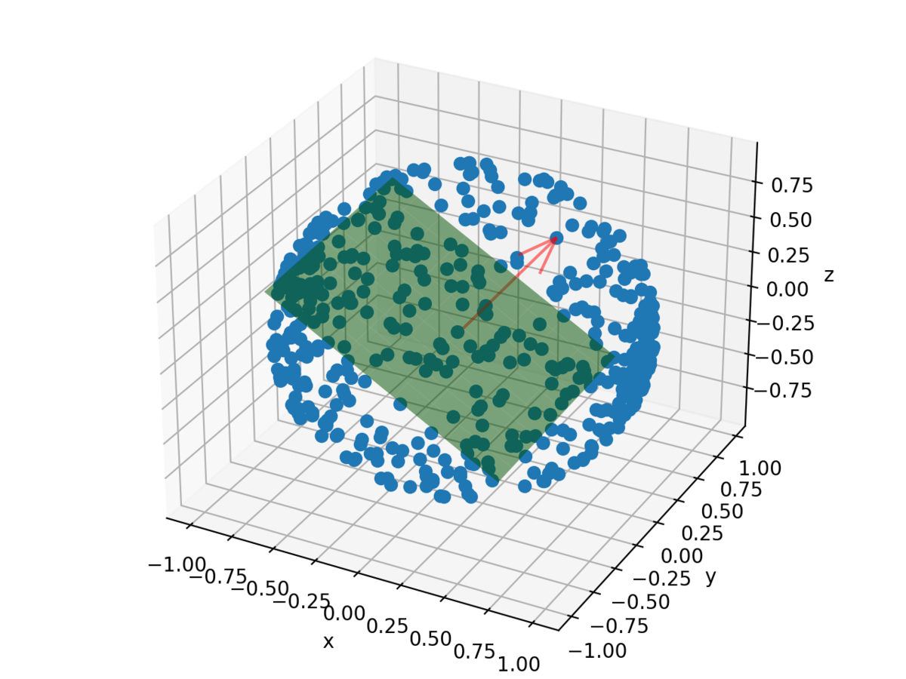

图2.2 一个三维随机投影分割示例

进一步，通过精巧设计随机映射中的分割平面，研究者完善了关于随机投影树的理论保障，即，在每一个叶子节点中，任意两点之间的距离存在上界。我们在此省略详细的数学结论与相关证明，感兴趣的读者可自行查阅相关论文。

##### 2.2.4.2.3 其它超平面分割策略

除了随机投影以外，还有一些其它方法来构造切分平面。比如，PCA树在每个中间节点在数据子集上进行主成分分析（Principle Component Analysis, PCA），找出特征值最大的特征向量，并以垂直于该向量的平面作为划分平面。其核心思想仍然是k-d树中寻找方差最大的维度进行划分。不同之处在于，PCA树不局限于某个坐标轴方向，而是在空间中所有可能的方向上找到了数据方差最大的一个，并以此来划分。在数据划分时，可以通过区分与所选取特征向量内积的符号来判断划分到哪个子节点。

注意到，以上方法相比于k-d树虽然可以更灵活的分区策略，和更紧凑的数据分区结果。但是在查询时，每次向下路由的判断成本也增加了。具体来说，k-d树只需要判断一个维度的值，而随机投影树、PCA树都需要计算内积，即计算所有维度。考虑到最近邻检索的查询性能需要同时考虑检索效率和检索精度，后续研究者又提出了如TP树这样的折衷变种，即在分区策略方面存在一定限制，但不固定于坐标轴，同时在检索路由树结构时仅需要常量级别的计算就可以判定。这种方法使得最终的整体查询性能更上一个台阶。

除此之外，如2.2.4.1中所讨论，作为一种基于空间分区的索引方案，边界问题始终是限制查询性能的一个瓶颈。为了减少边界问题带来的影响，溢出（spill）是一个常见的方案。即在树索引的每次分裂中，使用一个模糊的分割范围而非明确的分割平面。在分割范围之内的数据点同时进入到两个孩子节点中。这种方式通过增大空间开销以提升精度，因此溢出的分割范围需要谨慎确定。

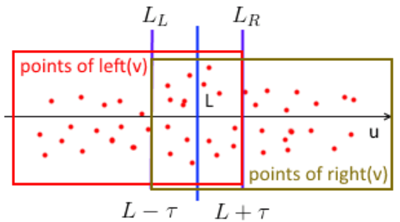

图2.3 溢出策略

#### 2.2.4.3 基于锚点的树索引

在上一节中，我们讨论了在基于超平面分区的树索引中通过设计超平面进行数据分区的多种方式。然而在高维空间中，对数据的划分可以不仅基于平面，而是任何形状的。这一思路进一步打开了树索引的设计空间。然而，更复杂的分割平面往往意味着更高的路由代价（即，判断向量属于哪个子分区），因此，平衡分割质量和查询效率也是这一类方法中的重要问题。本节主要介绍基于锚点的树索引，其主要的思想是首先在空间中确定一些锚点，然后基于和锚点的距离将数据区分开。因为这一类方法中只用到了距离的概念，其中的数据点是可以没有明确坐标，即不在欧式空间中，所以此类方法有时也被称之为基于距离的树索引，或度量空间索引。

##### 2.2.4.3.1 制高点树

类似于k-d树，制高点树（Vantage Point Tree， VP tree）也是一棵二叉树，自顶向下划分空间构建索引。在每次分裂中，制高点树在当前数据子集中随机选择一个点作为制高点（vantage point），然后计算其到数据子集中其它点的平均距离$mu$。然后以制高点为球心，$mu$为半径，画一个超球，在超球内的点进入左孩子节点，其余点进入右孩子节点。如下图2.4所示，在分裂时数据子集中的点根据到制高点的距离决定分类。

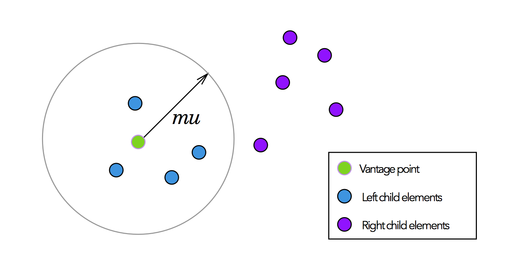

图2.4 制高点树分割示例

下图2.5展示了在一棵制高点树中对二维空间的最终划分。可以看到，在数据点密集的地方，会有更密集的分割；而在数据稀疏的地方，则划分较少。相比于基于超平面分区的树索引，制高点树的最大优势在于每一次分割都考虑了完整的距离，在高维向量的场景中，实际上考虑了向量的全部维度，因此可以期望得到质量更高的分区。

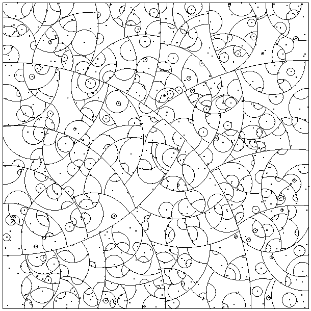

图2.5 制高点树对于一个二维空间的划分

在路由制高点树时，每次需要计算和锚点的距离。为降低路由代价，一种简单的方法是构造多叉树，用多个分位数来代替均值$mu$以进行分割。然而这种方式构造出来的空间分区是薄薄的一层圆环，使得在查询时往往一个查询向量的knn球（即， 以查询向量点为球心，以目前找到的最佳knn到查询点的距离为半径的超球）会和多个分区相交，影响剪枝能力和查询效率。

为解决这个问题，可以通过直接折叠制高点树的多层来构造树，即多制高点树（Multi-Vantage Point tree, M制高点树 tree）。多制高点树将制高点树树改成了一个多叉树，每个中间节点包含两个锚点。如下图所示，数据子集被划为了4个区（S1, S2, S3和S4）。在制高点树树中，划分4个区需要3次分割以及3个锚点；而在多制高点树中，仅需要2个锚点（即i和p）。数据首先基于锚点i做一次分割成S1+S2和S3+S4两个区，然后选择另一个锚点p，对此前分割成的两个区都计算平均距离，同时分割两个区，最终生成了S1, S2, S3和S4四个区。因为减少了一个锚点，也降低了三分之一的路由代价。

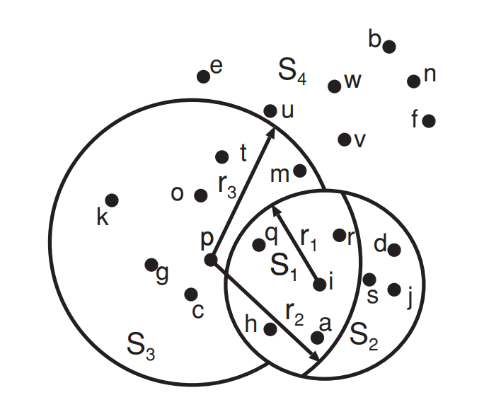

图2.6 多制高点树分割示例

##### 2.2.4.3.2 球树

另一种以超球的方式进行空间分区的树索引是球树。在球树中，每个节点代表高维空间中的一个超球，且是覆盖节点中所有向量的最小超球。球树是一个二叉树。球树的根节点以数据集的质心为球心，质心与数据集中点最远距离为半径画超球。然后将数据集用两个小球进行分割。分割的目标是使得两个孩子节点的超球体积最小，这样分割的粒度最细，查询时的定界也会更紧。

球树与上述其它树索引的分割方式的一个显著不同是，它既不要求父节点的空间区域全部被孩子节点所分割（即，允许在分割过程中，部分空间留有空白，不被任何孩子节点所代表），也不要求两个孩子节点的区域无重叠。

如图2.7所示，A节点被分为B和C两个节点，而A的其余部分则置空，因为这一部分没有任何数据点。C、D、E节点在分裂时孩子节点均有重叠。

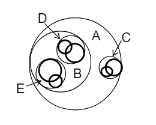

图2.7 球树对于二维空间的分割示例

构建球树有多种方法。一种最简单的构建方法称为k-d构建，顾名思义，这种构建方法和k-d树的构建很像，选择一个方差最大的维度，取中值将数据分裂成两半。然后在每一半数据上找最小覆盖球。

另一种方式优化了维度的选择，在所有维度中，选择使得最终两个孩子节点球体积最小的那个维度。

此外，一种经典的启发式方法是首先找到距离质心最远的点为p1，再找到距离p1最远的点为p2。然后将数据按照距离更近的方式划分给p1或p2，再构建最小覆盖球。

还有一种自底向上的方式也可以用于构建球树。算法维护一个待合并的球列表，该列表初始化为每个点。每次在列表中找到一对球使得合并后体积最小（或其它衡量条件，比如更大的球的直径最小），然后将它们合并成大球，再次放入列表。依次类推，直到列表中只剩一个根节点。

##### 2.2.4.3.3 M树

M树（Metric tree, M tree）是专为度量空间所设计的树索引，而且是用于支持磁盘数据的索引。其基本结构结合了球树和B+树的设计思路。如图2.8所示，M树的每个中间节点代表一个超球，以中间节点为根的子树中的数据全部位于这个超球内部。数据本身均位于叶子节点中，中间节点负责空间划分和查询导航。无论是哪种节点，节点中的每一项都代表数据集中的某个数据点，这一项还会包括该点到父节点对应项的距离，用于在查询中剪枝。中间节点还会包含其所代表超球的半径。

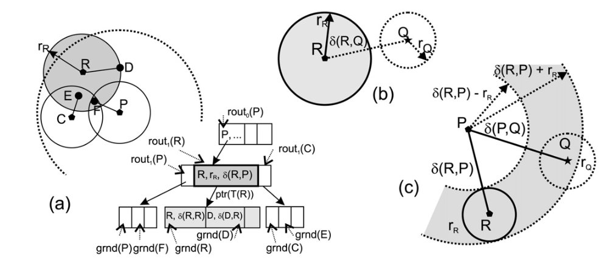

图2.8 M树示例 (a) 空间分区和数据点插入 (b)同级剪枝 (c)基于三角不等式的父级剪枝

和B+树相似，M树也以自底向上的方式构建。当一个节点中的项溢出最大容量时，就会分裂为两个节点，并产生一个父节点中的项。不同于B+树，由于高维向量数据无法排序，如何分裂成两个叶子节点成为M树构建的一个关键点。

一种常见的方式是如上一节中的球树的最后一种构建方式，遍历每一对数据点，构建两个超球，使得更大的球的半径最小的一对数据点成为锚点，成为父节点中的项。也可以通过采样降低复杂度。

在查询时，可以首先判断查询所在的球和中间节点中的项所代表的球是否会相交，如图2.8 (b)。若不想交，则跳过当前子树。此外，M树还可以通过三角不等式进行跨级剪枝。如图2.8 (c)，尽管查询点Q的球和父亲点P的球相交，因此当前子树无法跳过，但是可以通过三角不等式跳过其中一个子节点的项，比如图中以R为球心的超球。方法是计算P与R的距离和P与Q的距离的差的绝对值，注意到前者存于索引中，后者在查询时已经算过，因此无额外代价。若该值大于R与Q球半径之和，则可以跳过R的超球。

##### 2.2.4.3.4 层次化k均值树

层次化k均值树在每次分裂时将数据子集通过k均值进行聚类，聚类中的每个簇即为一个孩子节点。这意味着层次化k均值树是一个k叉树。注意到k均值聚类产生的空间分区是一个不规则的多边形。具体来说，是以各个聚类中心为顶点的Voronoi图中的Voronoi cell。层次化k均值树通过简单的算法，进一步延展了空间分区的设计空间。其相比于球树路由代价更高，每次路由时要和k个聚类中心计算距离。

另一方面，由于k均值聚类算法产生的是不均衡的聚类，层次化k均值树也就是一棵不平衡树。在极端情况下，可能在区分效果上退化到接近单链表，而且路由代价更高。在这种情况下，平衡K均值算法被提出构造尽量均衡的聚类。其核心思想在于使用k均值聚类时在聚类的目标函数中加入关于平衡性的限制，实际上是通过限制聚类质量以换取平衡性，这种方式可以有效提升层次化k均值树的查询性能和稳定性。

层次化k均值树由于出色的性能得到了广泛的应用。在计算机视觉领域中的FLANN库就是基于层次化k均值树构建，并基于用户需求设计了自适应的参数选择；在搜索领域，微软公司的SPTAG库也使用层次化k均值树作为图索引的辅助结构共同实现高效检索。

#### 2.2.4.4 基于降维策略的树索引

如2.2.4.1中提到，在高维空间中构造一个合适的分区方式构造索引是具有挑战性的。因此，一个间接构造索引的方式就是首先将数据降维，然后在低维空间上构建索引。由于降维往往是有信息损失的，所以此类方法的一个难点是如何在降维后保留原有的数据之间的近邻性。换句话说，在高维空间中接近的两个向量，在低维空间中也应该接近；在高维空间中较远的两个向量在低维空间中也应该较远。

在本节介绍的方法中，一部分索引在降维后也保留了精确查询的能力，一部分索引则退化为仅能支持近似查询。接下来，我们首先介绍一些通用的降维方法，然后介绍在一些特殊数据分布下可以采用的更为高效的降维方法，最后介绍如何基于空间填充曲线将多维数据将为一维。

##### 2.2.4.4.1 通用的降维方法

用于数据降维的通用方法包括主成分分析（PCA）、离散傅里叶变换（Discrete Fourier Transformation, DFT）和随机投影等。

主成分分析使用特征值最大的部分特征向量作为新的一组基，旋转原有向量至信息熵最大的几个方向上。主成分分析是线性分析，新的基是原有坐标轴基的线性组合，因此降维后的距离不超过原有坐标上的距离。

离散傅里叶变换是在信号分析中的常见方法，可以将数据从时域转换为频域。其本质是将高维向量当做时间序列看待，用正弦波的部分参数模拟序列的形状特征。参数保留越多则信息损失越少。离散傅里叶变换也是线性变换，且复杂度更低。因此，转换后的距离也不超过转换前向量的距离。

随机投影是说将高维数据随投影到低维空间中，其信息损失在一定概率下是很小的。其基于的数学原理是Johnson-Lindenstrauss引理，也是局部敏感哈希（LSH）索引家族的理论基础。详细介绍请读者查阅本书2.2.3节。然而需要注意的是，经过随机投影后，数据之间的相邻性仅能在概率条件下得到保证，因此会失去严格的距离下界，因而丧失索引精确查询的能力。

##### 2.2.4.4.2 基于数据特征降维

高维向量的数据来源非常广泛，除了神经网络的嵌入向量以外，还包括时间序列、轨迹等。这些具有特殊数据分布特征的数据集可以采用更为高效的方法进行降维。本节以时间序列为例，介绍适用于这种数据类型的高效树索引。

相比于一般的高维向量，时间序列的主要特征是在相邻维度（时刻）之间的值具有连续性，少有突变，且值的范围稳定。因此在序列连续的一小段上，值普遍是接近的。在这种情况下，一种有效的降维方式是分段聚合近似（PAA），即将序列分成等长若干连续$m$段，在每段取各维数据均值，即可将数据降为$m$维。

如图2.9(a)，通过分成三段，即可将9维序列将为3维。进一步，我们可以将均值所处的值的范围按照某种分布（比如正态分布）划分为若干离散分区，并用二进制码对空间进行分区，此时序列可以编码为$m$个二进制码，二进制码的基数取决于数据的精度。这个编码被称为SAX。在图2.9(a)中，SAX码为（100, 011, 010）。

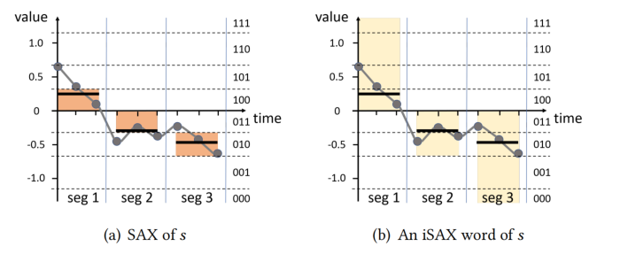

图2.9 iSAX降维示例 (a) PAA，SAX (b) iSAX

分区可以以层次化的方式划分。我们首先确定一条边界，比如坐标横轴0，值大于0的区域编码为1，小于0的编码为0。进一步，在大于0的区域中我们可以再确定一条内部边界，比如0.67，值大于0.67的区域编码为11，小于的编码为10。依次类推，通过增加编码的基数提高对数据的区分性。

这种可变基数的分区为数据编码提供了灵活性，比如某一段上值为0.9。那它既可以编码为一位的1，也可以编码为两位的11。进一步，这种方式也提供了层次化索引的可能，即iSAX索引。如图2.10，在iSAX树索引中，第一层在每段均只有一位编码，即第一层有$2^m$个节点，在这些节点之下，通过逐渐细化编码，完成时序数据分区。

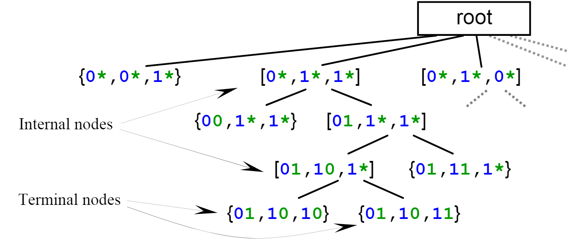

图2.10 iSAX树索引

由于降维的有效性且降维后的维数非常低，iSAX索引的构建和查询速度都非常快。但是，在应用到时序特征不明显的数据集上，iSAX树索引会存在明显的倾斜性，每个节点中的序列距离也会变大，索引性能会退化。

此外，iSAX降维保持着降维后点之间距离的下界特征，因此具有精确查询的功能。iSAX的索引结构可以进一步优化。Dumpy索引将iSAX索引拓展为自适应的多叉树结构，使得树索引的叶子节点更紧凑、大小更均衡，因而更适应磁盘数据。

##### 2.2.4.4.3 基于锚点降维

在度量空间中，通常会使用锚点将数据转移到坐标空间中。具体来说，可以在度量空间中选择一些锚点（可以不在数据集中），将数据点到各个锚点的距离确定为数据的坐标。也就是说，有多少个锚点降维后数据就有多少维。

这种方式通常会保留距离的下界属性。如图2.11，选择$o_1$, $o_6$两个锚点后，可以在坐标空间使用$L_{\infin}$范数作为距离度量，即以各维之间距离的最大值作为降维后的距离。此时在此基础上构建的索引也可以支持精确查询。

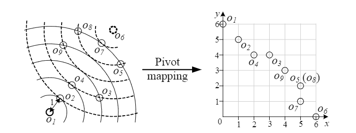

图2.11 基于锚点降维的示例

显然，锚点的选取是这一类降维方法的关键点。现有的锚点选取方法的核心思想是让锚点尽可能均匀分布在数据集的各个位置上。具体来说，包括让锚点彼此之间距离尽量远，或者让锚点和数据集中点的距离分布尽可能方差较大，或者让降维之后的距离变化较小。在大多数情况，最后一种策略最为奏效。在本书中，我们不再详细讨论。

##### 2.2.4.4.4 基于空间填充曲线降维

空间填充曲线可以将一个一维曲线铺满多维空间中的所有坐标格子。如图2.12所示，这种方式通过特殊的曲线形状尽可能让空间中更接近的两个点，也在曲线中的顺序更邻近。通过这种方式，可以将多维数据排序，即降为一维。然后就可以通过经典的树索引，如B+树、跳表等对其进行索引。比较常见的空间填充曲线是希尔伯特曲线（Hilbert curve）和z形曲线（z-order curve）。

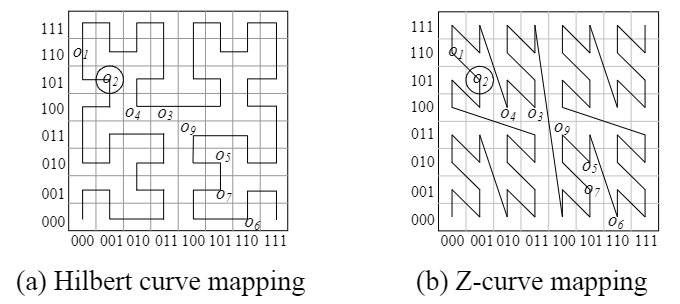

图2.12 空间填充曲线示例

但注意到，当空间填充曲线扩展至高维时，其近邻性保持的能力将大幅降低，因此直接将其应用于高维数据降维会使得查询精确性大幅降低。因此，一个通常的索引设计思路是，先使用其它降维方法将数据降至低维，然后用空间填充曲线将低维数据定序，最后使用B+树对数据进行索引。

比如，在时序数据上，Coconut索引先使用SAX技术进行降维，然后使用z形曲线定序，最终使用B+树建立索引实现近似最近邻检索。

在度量空间数据上，SPB树索引首先基于锚点降维，然后使用希尔伯特曲线定序，再通过改良B+树索引，使得其保持了精确搜索的能力。

HD-index首先将高维数据分段，在每段上通过希尔伯特曲线定序，然后建立多棵B+树，查询时在多棵B+树中同时检验（参考随机k-d森林的思想）以补充近似最近邻查询的精度。

#### 2.2.4.5 总结

在本节中，我们讨论了树索引的核心设计思想，并以三大类树索引介绍了典型的设计思路和查询算法。总的来说，树索引原理简单、实现容易、可伸缩性强、资源占用少，在实践中有很强的可用性。

然而，由于近年来需要处理的向量数据维度越来越高，树索引由于边界问题和分区的有效性问题，查询效率逐渐退化，往往不能再海量数据的线上应用中作为主力索引存在。

在这种情况下，树索引的发展方向至少包括两个方面。一个是在现代高维向量数据集上的广泛评测，获得在不同数据分布上性能变化的观察。据既有研究的结论，在部分数据集上，树索引仍然保持着超过图索引的查询性能。

另一个是和查询性能更高的索引相结合，比如图索引，使得优势互补，以期获得未来向量索引设计的新范式。
