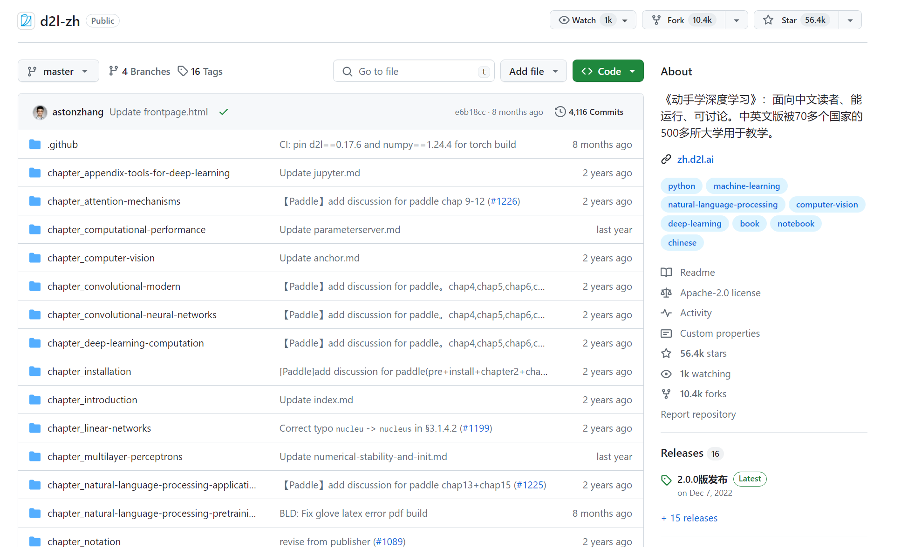
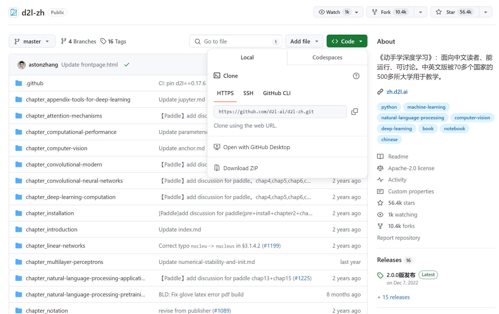
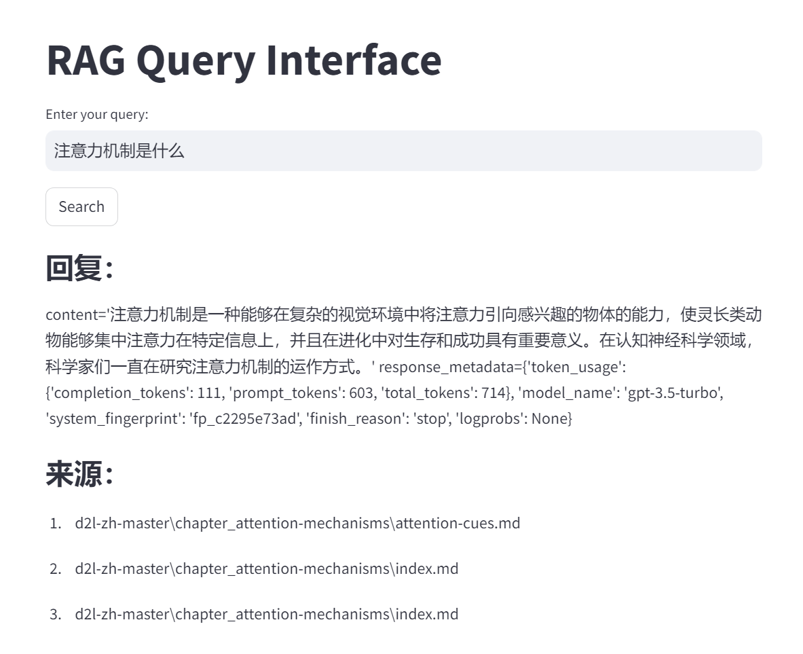
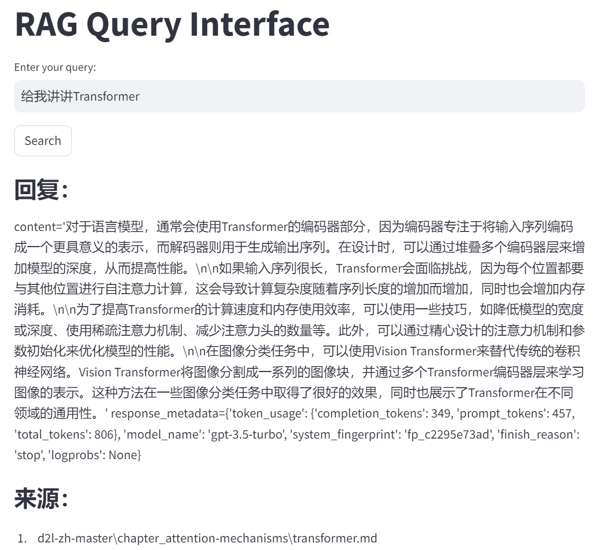
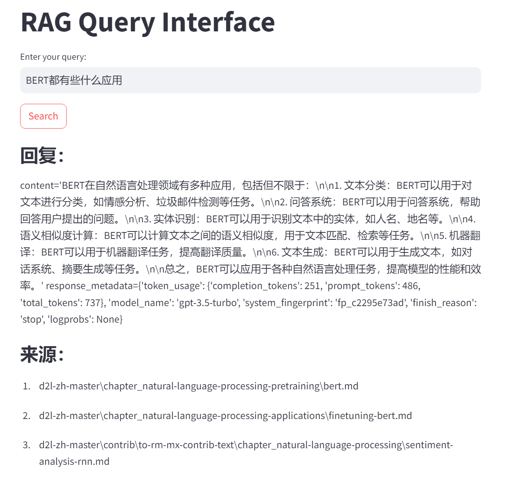

# 基于RAG的知识问答系统实战

这里将以[《动手学深度学习》](https://zh.d2l.ai/)一书为例，演示如何基于RAG建立基础的知识问答系统，框架选择为[`Langchain`](https://www.langchain.com/)。

## 数据准备

在 `Langchain` 中，检索增强生成（RAG）系统可以使用多种文档类型，但主要操作文本数据。以下是一些你可以在 `Langchain` 为RAG系统使用的常见文档类型和数据源：

1. **纯文本文件**：最直接和最常用的文档类型之一，可以直接从.txt文件中加载文本数据。
2. **Markdown文件**：`Langchain` 可以解析和处理Markdown文件，这些文件是包含简单标记的纯文本文件。
3. **HTML文件**：可以从HTML文件中提取文本。`Langchain` 具备处理HTML结构的能力，能够仅提取文本内容，去除HTML标签。
4. **PDF文档**：对于PDF文档，可以进行文本提取，但需要专门的 [`PyPDFLoader`](https://python.langchain.com/docs/modules/data_connection/document_loaders/pdf/) 库来处理从PDF到 `Langchain` 可以使用的文本格式的转换。
5. **CSV/TSV文件**：如果你的数据以CSV或TSV文件的形式结构化，可以读取这些文件，并使用其中的文本数据。每行可以被视为一个独立的文档或文档的一部分。
6. **数据库条目**：`Langchain` 可以与数据库交互。可以查询数据库，并使用检索到的条目作为文档或RAG系统的一部分。
7. **API响应**：从API获取的文本数据也可以被整合到RAG系统中。这允许基于通过API获取的最新数据动态更新知识库。

为了将这些文档整合到 `Langchain` 中，通常需要将它们处理成RAG系统可以查询的格式。这通常涉及创建一个结构化的数据集，每个条目代表一个可检索的信息单元，如一个段落或文档摘要。

在本章中，我们将使用《动手学深度学习》中文版作为数据源。具体下载方式如下：

1. 访问[d2l-zh主页](https://github.com/d2l-ai/d2l-zh)
2. 点击Code按钮
3. 点击Download ZIP，进行下载

4. 选择一个英文路径，将压缩包解压在这一路径下，这一路径将是RAG知识问答系统的根路径

## 环境配置

需要安装的第三方库如下

```shell
pip install langchain
pip install langchain-openai
pip install shutil
pip install os
pip install streamlit
pip install opencv-python
pip install pillow_heif
pip install unstructured
pip install chromadb
pip install openai
pip install tiktoken
```

OpenAI的API Key也可以一并进行配置，获取方法如下：

1. 登录[OpenAI开发者平台](https://platform.openai.com/docs/overview)
2. 在左侧边栏选择API keys
3. 选择 Create new secret key，并将其拷贝出来保存

配置方法如下：

1. 以管理员身份运行Windows Powershell
2. `setx OPENAI_API_KEY "Your OpenAI API Key" -m` （将拷贝出的OpenAI API Key替换到""中）
3. 关闭Windows Powershell，在项目路径下重新打开
4. `echo $env:OPENAI_API_KEY`，如果成功显示API key则配置成功

## 创建向量

以下代码源自 `create_db.py`

### 第三方库导入

```python
from langchain_community.document_loaders import DirectoryLoader
from langchain.text_splitter import RecursiveCharacterTextSplitter
from langchain.schema import Document
from langchain_community.embeddings import OpenAIEmbeddings
from langchain.vectorstores.chroma import Chroma
import os
import shutil
```

### 路径配置

```python
CHROMA_PATH = "chroma"
DATA_PATH = "d2l-zh-master"
```

### 读入文件

从指定目录加载文档。它使用 `DirectoryLoader` 类，设计为从指定路径（在实战中为 `DATA_PATH`）加载匹配特定模式（在实战中为扩展名为 `.md` 的 Markdown 文件）的文件。加载器读取这些文档，并构建 `Document` 对象的列表，这些对象表示加载的文本及其相关元数据（如文件路径）。

```python
def load_documents():
    loader = DirectoryLoader(DATA_PATH, glob="**/*.md")
    documents = loader.load()
    return documents
```

### 文档分割

在加载文档后，接收 `Document` 对象的列表作为输入。采用 `RecursiveCharacterTextSplitter`，配置为将文本分割成大约300个字符的块，连续块之间有100个字符的重叠。这种方法有助于将大型文档分解成更小的部分，使它们更易于处理和嵌入。分割器还保持每个块相对于原始文档的索引位置，这对于稍后的参考和检索非常有用。

```python
def split_text(documents: list[Document]):
    text_splitter = RecursiveCharacterTextSplitter(
        chunk_size=300,
        chunk_overlap=100,
        length_function=len,
        add_start_index=True,
    )
    chunks = text_splitter.split_documents(documents)
    print(f"Split {len(documents)} documents into {len(chunks)} chunks.")

    document = chunks[10]
    print(document.page_content)
    print(document.metadata)

    return chunks
```

### 向量存储

将处理后的块存储到向量数据库中，具体使用 Chroma 向量存储。首先检查 Chroma 数据库的目录是否存在，如果存在则清除，确保从头开始。然后，使用块和一个嵌入模型（`OpenAIEmbeddings`）初始化 Chroma 数据库，实战中，模型需要一个 OpenAI API 密钥来获取嵌入。这些嵌入表示文本在高维空间中的表现，允许进行高效的相似性搜索和检索。最后，块被持久化存储在数据库中，使它们可用于进一步的应用，如搜索或分析。

```python
def save_to_chroma(chunks: list[Document], openai_api_key: str):
    if os.path.exists(CHROMA_PATH):
        shutil.rmtree(CHROMA_PATH)

    db = Chroma.from_documents(
        chunks, OpenAIEmbeddings(api_key=openai_api_key), persist_directory=CHROMA_PATH
    )
    db.persist()
    print(f"Saved {len(chunks)} chunks to {CHROMA_PATH}.")
```

注：此处还有另一种方法进行OpenAI API key的配置，即在python程序执行过程中获取

```python
import os
import getpass

os.environ['OPENAI_API_KEY'] = getpass.getpass('OpenAI API Key:')
```

会收到如下的提示

```shell
OpenAI API Key: ········
```

键入即可

### `main`函数

将上述提到的函数在 `main` 中进行调用

```python
def generate_data_store(openai_api_key):
    documents = load_documents()
    chunks = split_text(documents)
    save_to_chroma(chunks, openai_api_key)
    
def main(openai_api_key):
    generate_data_store(openai_api_key)
    
if __name__ == "__main__":
    openai_api_key = os.environ.get('OPENAI_API_KEY')
    if openai_api_key is None:
        raise ValueError("Set the OPENAI_API_KEY environment variable.")
    main(openai_api_key)
```

### 代码执行

在Windows Powershell中执行 `python create_db.py`，待运行完成即可

## 内容问答

以下代码源自 `vector_search.py`

### 第三方库导入

```python
import streamlit as st
from langchain.vectorstores.chroma import Chroma
from langchain_openai import OpenAIEmbeddings, ChatOpenAI
from langchain.prompts import ChatPromptTemplate
```

### 路径配置

```python
CHROMA_PATH = "chroma"
```

### prompt模板

```python
PROMPT_TEMPLATE = """
请仅根据以下内容回答问题：

{context}

---

根据上述语境回答问题： {question}
"""
```

### 向量搜索

接收用户的查询文本，使用 `OpenAIEmbeddings` 在向量数据库 `Chroma` 中进行相似性搜索，根据搜索结果构建上下文并通过 `ChatOpenAI` 模型生成回答。如果搜索结果的相关性较低或无结果，则返回无匹配信息。

```python
def query_data(query_text):
    embedding_function = OpenAIEmbeddings()
    db = Chroma(persist_directory=CHROMA_PATH, embedding_function=embedding_function)
    results = db.similarity_search_with_relevance_scores(query_text, k=3)
    if len(results) == 0 or results[0][1] < 0.7:
        return "无法找到匹配结果。", []
    context_text = "\n\n---\n\n".join([doc.page_content for doc, _score in results])
    prompt_template = ChatPromptTemplate.from_template(PROMPT_TEMPLATE)
    prompt = prompt_template.format(context=context_text, question=query_text)
    model = ChatOpenAI()
    response_text = model.invoke(prompt)
    sources = [doc.metadata.get("source", None) for doc, _score in results]
    formatted_response = f"{response_text}"
    return formatted_response, sources
```

### 前端展示

设置简易的用户界面，包括查询输入和按钮，并显示查询结果及其来源。

```python
def main():
    st.title("RAG Query Interface")
    query_text = st.text_input("Enter your query:")
    if st.button("Search"):
        raw_response, sources = query_data(query_text)

        st.subheader("回复：")
        st.write(raw_response)

        if sources:
            st.subheader("来源：")
            for i, source in enumerate(sources):
                st.write(f"{i + 1}. {source}")
```

### 代码执行

在Windows Powershell中执行 `streamlit run vector_search.py`，会自动开启浏览器窗口，在Enter your query下面的对话框中键入问题，点击search即可得到答案。

## 实例演示







回复中将会给出AI回答的内容以及对应的元数据，来源中则会指向对应文档，使得答案更清晰可靠。
